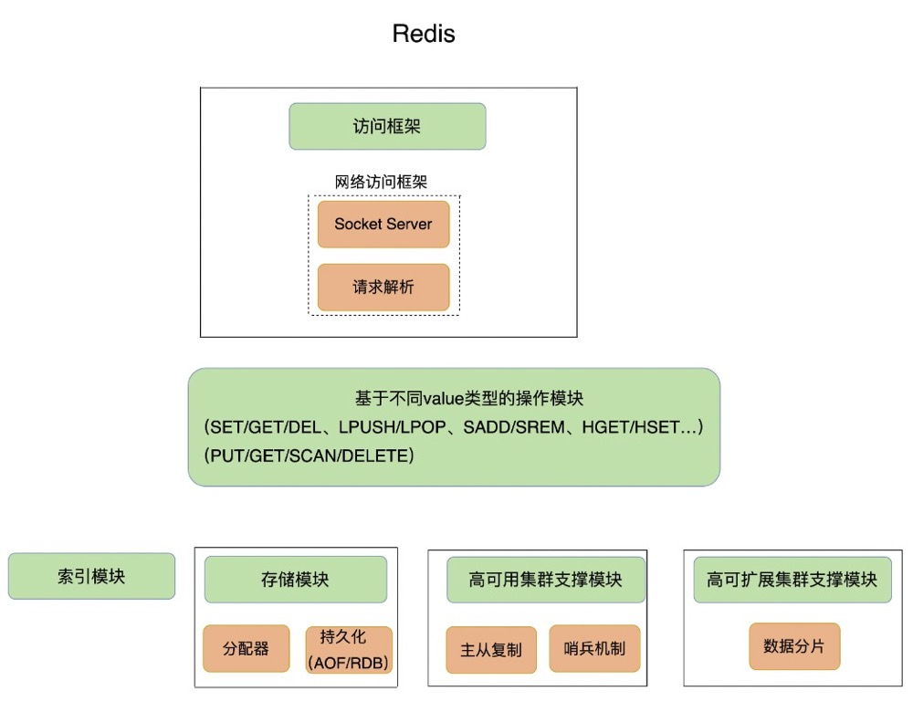
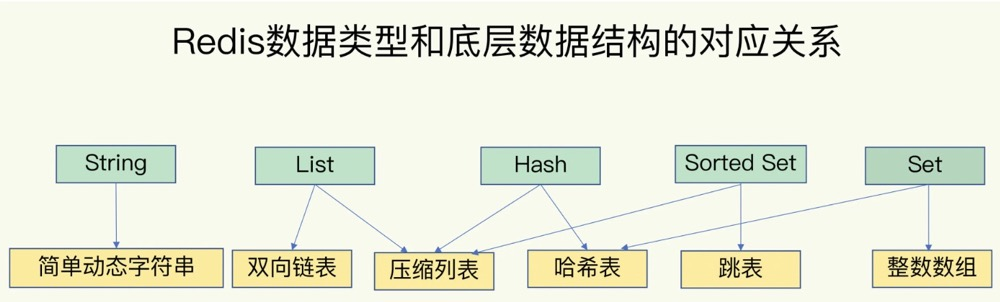
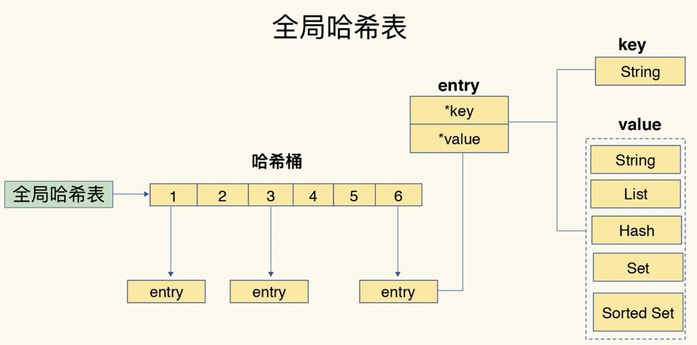
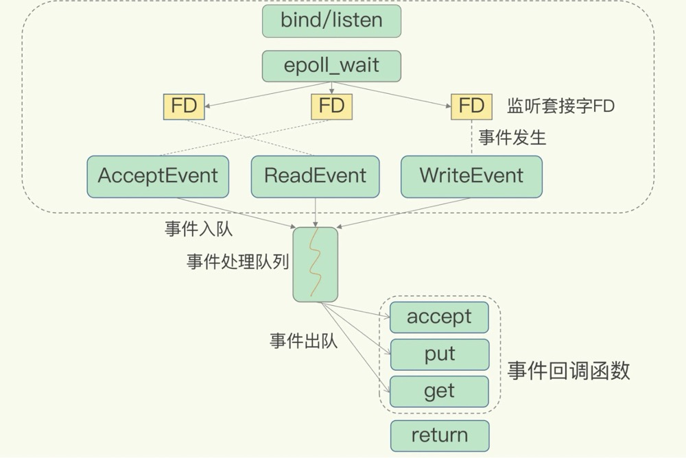
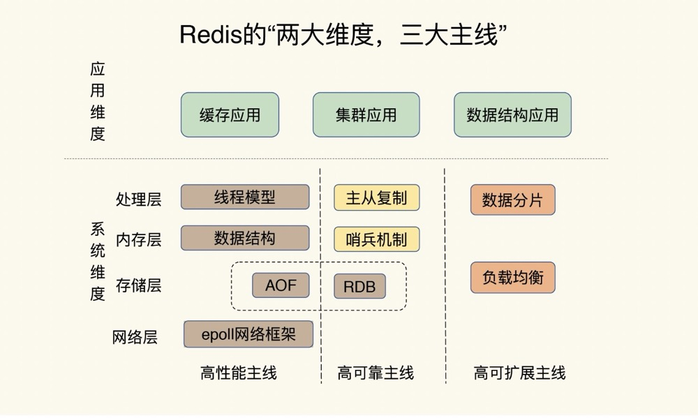
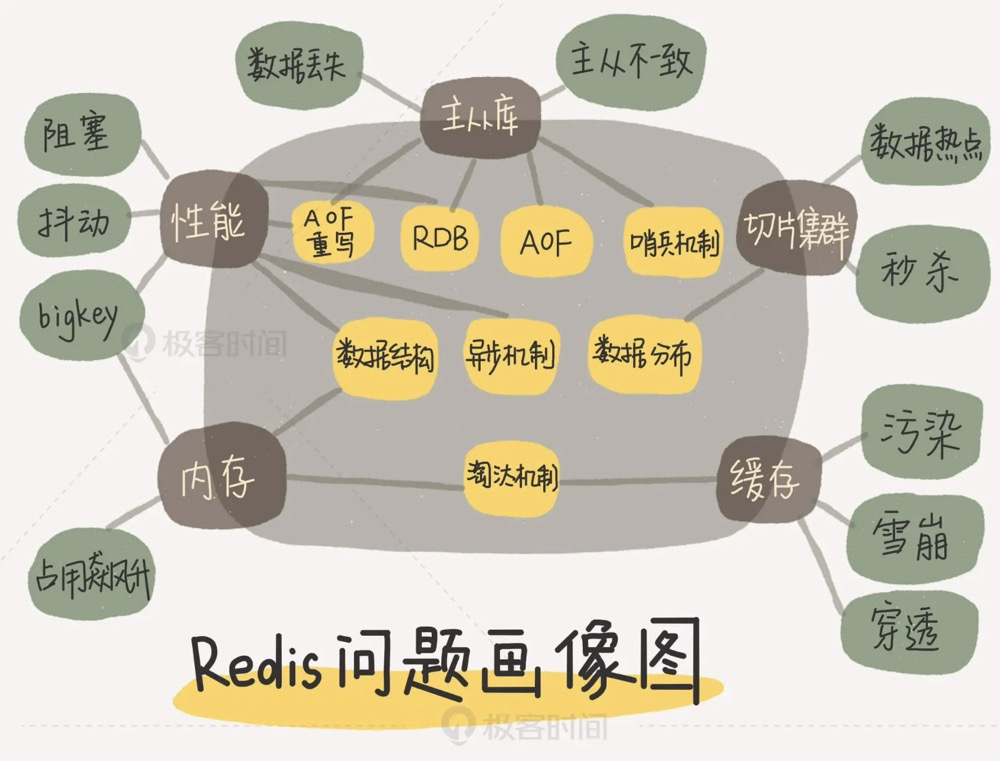

# 基本架构
键值数据库需要考虑的功能点
* 支持存哪些数据：String、哈希表、列表、集合等
* 对数据做什么操作：GET、SET、DEL、EXISTS、SCAN等等
* 采用什么访问模式：
  * 一种是通过函数库调用的方式供外部应用使用
  * 另一种是通过网络框架以 Socket 通信的形式对外提供键值对操作，这种形式可以提供广泛的键值存储服务。
* 如何定位键值对的位置：依赖于键值数据库的索引模块，让键值数据库根据 key 找到相应 value 的存储位置，进而执行操作。索引的类型有很多，常见的有哈希表、B+ 树、字典树等。
* 不同操作的具体逻辑：找到存储位置之后，需要进一步执行的操作的具体逻辑的差异。
* 实现重启后快速提供服务：
  * 内存分配器的选择，避免较严重的内存碎片问题
  * 持久化功能

# 数据结构

## 键和值的结构
全局哈希表：可以用 O(1) 的时间复杂度来快速查找到键值对——我们只需要计算键的哈希值，就可以知道它所对应的哈希桶位置，然后就可以访问相应的 entry 元素。

### 哈希表的冲突和rehash问题
#### 哈希表冲突
两个 key 的哈希值和哈希桶计算对应关系时重合，采用链式哈希解决即同一个哈希桶中的多个元素用一个链表来保存，它们之间依次用指针连接。哈希冲突越来越多，这就会导致某些哈希冲突链过长，进而导致这个链上的元素查找耗时长，效率降低。

解决方案：对哈希表rehash操作
#### rehash 
增加现有的哈希桶数量，让逐渐增多的 entry 元素能在更多的桶之间分散保存，减少单个桶中的元素数量，从而减少单个桶中的冲突。

为了使 rehash 操作更高效，Redis 默认使用了两个全局哈希表：哈希表 1 和哈希表 2。一开始，当你刚插入数据时，默认使用哈希表 1，此时的哈希表 2 并没有被分配空间。rehash步骤
* 给哈希表 2 分配更大的空间，例如是当前哈希表 1 大小的两倍；
* 把哈希表 1 中的数据重新映射并拷贝到哈希表 2 中；
  * 大量的数据拷贝会造成线程阻塞，无法服务其他请求。解决方案：渐进式 rehash
  * 渐进式 rehash：拷贝数据时，Redis 仍然正常处理客户端请求，每处理一个请求时，从哈希表 1 中的第一个索引位置开始，顺带着将这个索引位置上的所有 entries 拷贝到哈希表 2 中；等处理下一个请求时，再顺带拷贝哈希表 1 中的下一个索引位置的 entries。
* 释放哈希表 1 的空间。

## 集合数据的操作
### 数据结构
集合类型的底层数据结构主要有 5 种：
* 整数数组：操作复杂度是 O(N)
* 双向链表：操作复杂度是 O(N)
* 哈希表：操作复杂度是 O(1)
* 压缩列表：在表头有三个字段 zlbytes、zltail 和 zllen，分别表示列表长度、列表尾的偏移量和列表中的 entry 个数；压缩列表在表尾还有一个 zlend，表示列表结束。
  * 查找定位第一个元素和最后一个元素复杂度是 O(1)
  * 查找其他元素时复杂度是 O(N)
* 跳表：增加了多级索引，通过索引位置的几个跳转，实现数据的快速定位。查找复杂度是 O(logN)
### 操作
有读写单个集合元素的，例如 HGET、HSET。也有操作多个元素的，例如 SADD，还有对整个集合进行遍历操作的，例如 SMEMBERS。
* 单元素操作，是指每一种集合类型对单个数据实现的增删改查操作。操作复杂度一般跟底层数据结构有关。
* 范围操作，是指集合类型中的遍历操作，可以返回集合中的所有数据。比如：HGETALL、SMEMBERS等。这类操作的复杂度一般是 O(N)，比较耗时，我们应该尽量避免。
* 统计操作，是指集合类型对集合中所有元素个数的记录。操作复杂度只有 O(1)
* 某些数据结构的特殊记录，比如压缩列表和双向链表都会记录表头和表尾的偏移量。对于 List 类型的 LPOP、RPOP、LPUSH、RPUSH 这四个操作来说，它们是在列表的头尾增删元素，这就可以通过偏移量直接定位，所以它们的复杂度也只有 O(1)

# 高性能IO模型
Redis是单线程。

没用多线程原因：
* 多线程编程模式面临的共享资源的并发访问控制问题，如果没有精细的设计，只是简单地采用一个粗粒度互斥锁，就会出现即使增加了线程，大部分线程也在等待获取访问共享资源的互斥锁，并行变串行，系统吞吐率并没有随着线程的增加而增加。
* 采用多线程开发一般会引入同步原语来保护共享资源的并发访问，这也会降低系统代码的易调试性和可维护性。

## 单线程的Redis快的原因
刨除Redis的存储介质和高效的数据结构外。Redis 采用了多路复用机制，使其在网络 IO 操作中能并发处理大量的客户端请求，实现高吞吐率。

### 基本 IO 模型与阻塞点
以 Get 请求为例，为了处理一个 Get 请求，需要监听客户端请求（bind/listen），和客户端建立连接（accept），从 socket 中读取请求（recv），解析客户端发送请求（parse），根据请求类型读取键值数据（get），最后给客户端返回结果，即向 socket 中写回数据（send）。

其中bind/listen、accept、recv、parse 和 send 属于网络 IO 处理，而 get 属于键值数据操作。
网络 IO 操作中，有潜在的阻塞点，分别是 `accept()`（监听到一个客户端有连接请求，但一直未能成功建立起连接时） 和 `recv()`（通过 recv() 从一个客户端读取数据时，如果数据一直没有到达）。

### 非阻塞模式
Socket 网络模型的非阻塞模式设置，主要体现在三个关键的函数调用
1. socket() 方法会返回主动套接字
2. 然后调用 listen() 方法，将主动套接字转化为监听套接字，此时，可以监听来自客户端的连接请求。可以设置accept()为非阻塞的。
3. 最后，调用 accept() 方法接收到达的客户端连接，并返回已连接套接字。可以设置send()/recv()为非阻塞。

### 基于多路复用的高性能 I/O 模型
在 Redis 只运行单线程的情况下，该机制允许内核中，同时存在多个监听套接字和已连接套接字。内核会一直监听这些套接字上的连接请求或数据请求。一旦有请求到达，就会交给 Redis 线程处理，这就实现了一个 Redis 线程处理多个 IO 流的效果。

Redis 线程不会阻塞在某一个特定的客户端请求处理上，可以同时和多个客户端连接并处理请求，从而提升并发性。

# 总结

