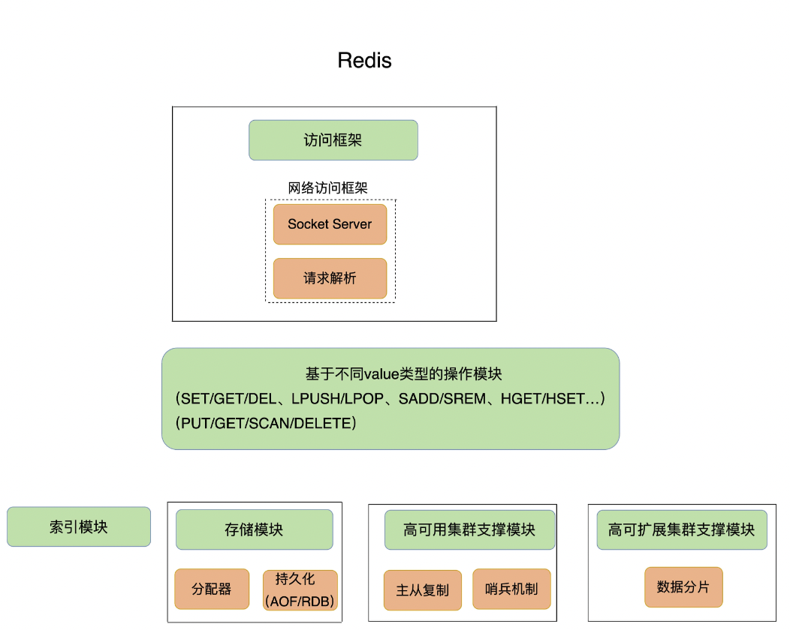
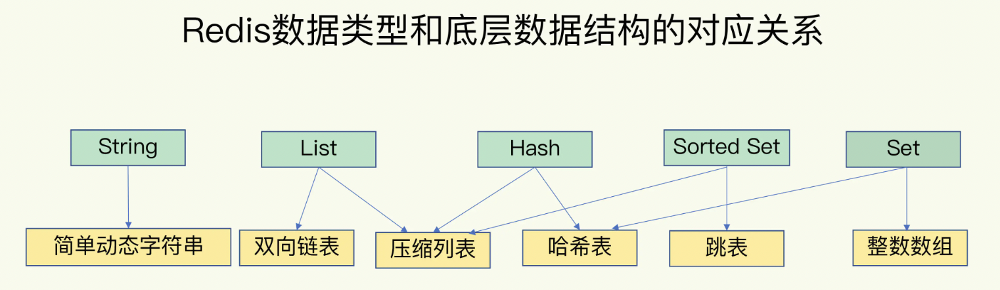
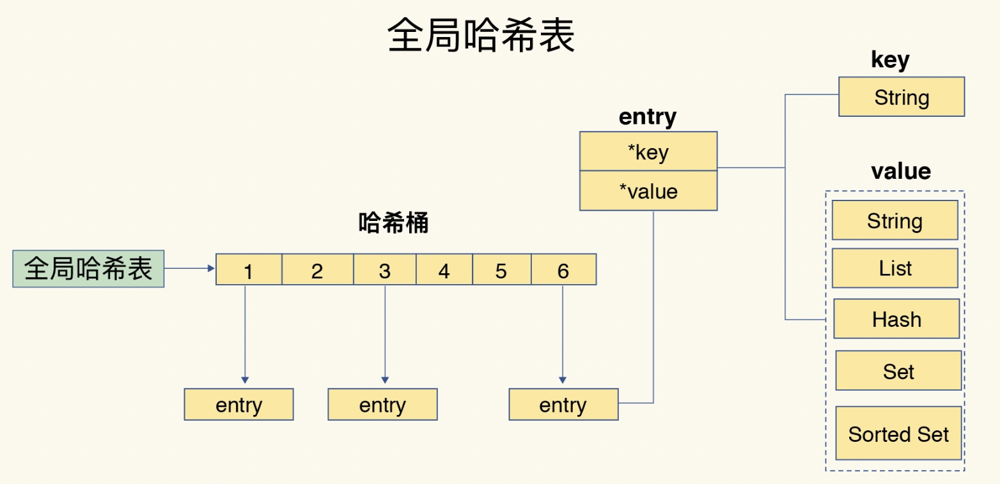
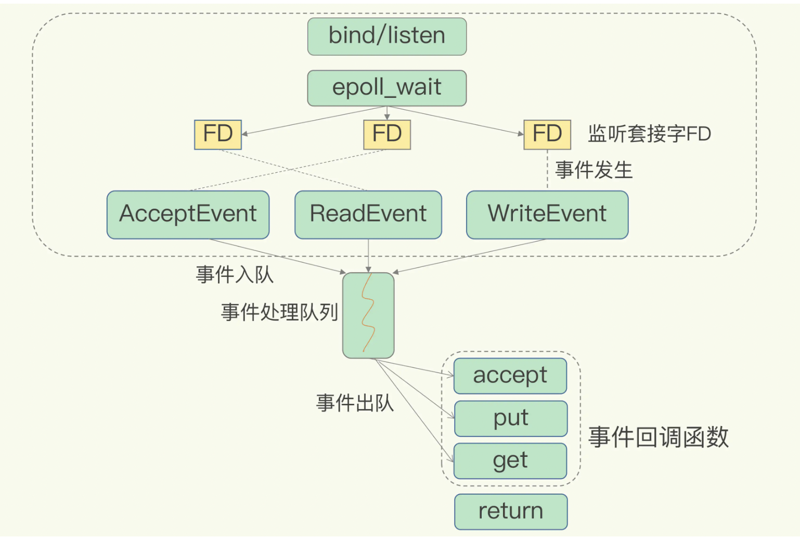
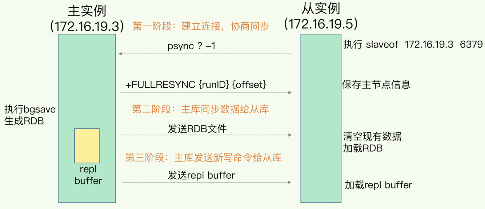
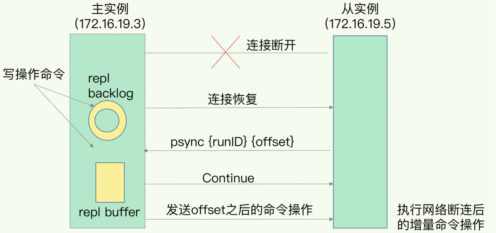
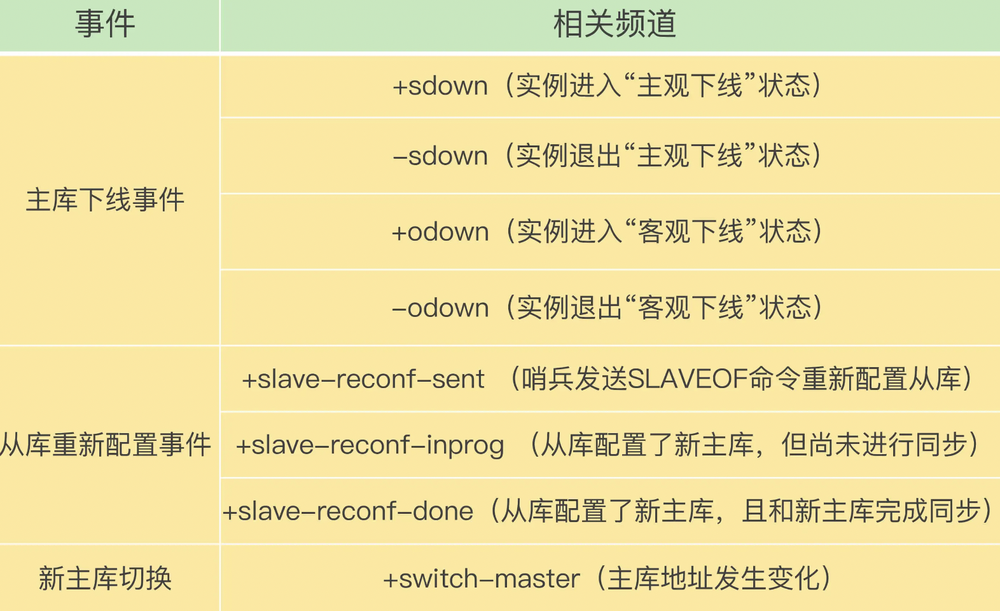
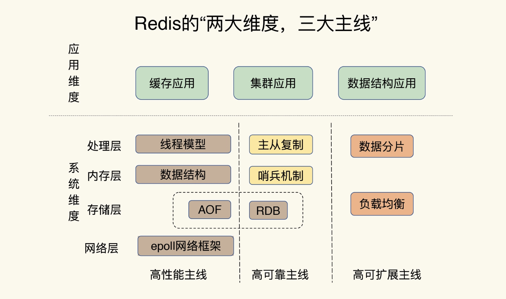
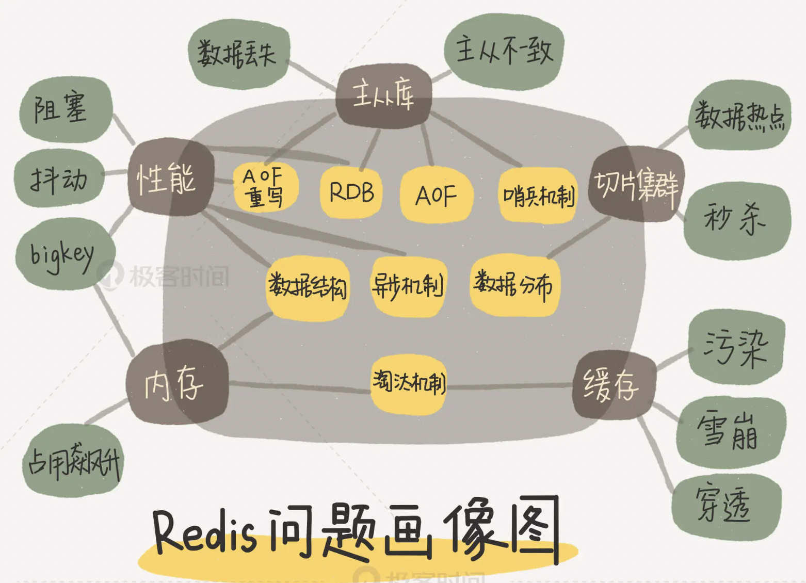

# 基本架构
键值数据库需要考虑的功能点
* 支持存哪些数据：String、哈希表、列表、集合等
* 对数据做什么操作：GET、SET、DEL、EXISTS、SCAN等等
* 采用什么访问模式：
  * 一种是通过函数库调用的方式供外部应用使用
  * 另一种是通过网络框架以 Socket 通信的形式对外提供键值对操作，这种形式可以提供广泛的键值存储服务。
* 如何定位键值对的位置：依赖于键值数据库的索引模块，让键值数据库根据 key 找到相应 value 的存储位置，进而执行操作。索引的类型有很多，常见的有哈希表、B+ 树、字典树等。
* 不同操作的具体逻辑：找到存储位置之后，需要进一步执行的操作的具体逻辑的差异。
* 实现重启后快速提供服务：
  * 内存分配器的选择，避免较严重的内存碎片问题
  * 持久化功能




# 数据结构


## 键和值的结构
全局哈希表：可以用 O(1) 的时间复杂度来快速查找到键值对——我们只需要计算键的哈希值，就可以知道它所对应的哈希桶位置，然后就可以访问相应的 entry 元素。


### 哈希表的冲突和rehash问题
#### 哈希表冲突
两个 key 的哈希值和哈希桶计算对应关系时重合，采用链式哈希解决即同一个哈希桶中的多个元素用一个链表来保存，它们之间依次用指针连接。哈希冲突越来越多，这就会导致某些哈希冲突链过长，进而导致这个链上的元素查找耗时长，效率降低。

解决方案：对哈希表rehash操作
#### rehash 
增加现有的哈希桶数量，让逐渐增多的 entry 元素能在更多的桶之间分散保存，减少单个桶中的元素数量，从而减少单个桶中的冲突。

为了使 rehash 操作更高效，Redis 默认使用了两个全局哈希表：哈希表 1 和哈希表 2。一开始，当你刚插入数据时，默认使用哈希表 1，此时的哈希表 2 并没有被分配空间。rehash步骤
* 给哈希表 2 分配更大的空间，例如是当前哈希表 1 大小的两倍；
* 把哈希表 1 中的数据重新映射并拷贝到哈希表 2 中；
  * 大量的数据拷贝会造成线程阻塞，无法服务其他请求。解决方案：渐进式 rehash
  * 渐进式 rehash：拷贝数据时，Redis 仍然正常处理客户端请求，每处理一个请求时，从哈希表 1 中的第一个索引位置开始，顺带着将这个索引位置上的所有 entries 拷贝到哈希表 2 中；等处理下一个请求时，再顺带拷贝哈希表 1 中的下一个索引位置的 entries。
* 释放哈希表 1 的空间。

## 集合数据的操作
### 数据结构
集合类型的底层数据结构主要有 5 种：
* 整数数组：操作复杂度是 O(N)
* 双向链表：操作复杂度是 O(N)
* 哈希表：操作复杂度是 O(1)
* 压缩列表：在表头有三个字段 zlbytes、zltail 和 zllen，分别表示列表长度、列表尾的偏移量和列表中的 entry 个数；压缩列表在表尾还有一个 zlend，表示列表结束。
  * 查找定位第一个元素和最后一个元素复杂度是 O(1)
  * 查找其他元素时复杂度是 O(N)
* 跳表：增加了多级索引，通过索引位置的几个跳转，实现数据的快速定位。查找复杂度是 O(logN)
### 操作
有读写单个集合元素的，例如 HGET、HSET。也有操作多个元素的，例如 SADD，还有对整个集合进行遍历操作的，例如 SMEMBERS。
* 单元素操作，是指每一种集合类型对单个数据实现的增删改查操作。操作复杂度一般跟底层数据结构有关。
* 范围操作，是指集合类型中的遍历操作，可以返回集合中的所有数据。比如：HGETALL、SMEMBERS等。这类操作的复杂度一般是 O(N)，比较耗时，我们应该尽量避免。
* 统计操作，是指集合类型对集合中所有元素个数的记录。操作复杂度只有 O(1)
* 某些数据结构的特殊记录，比如压缩列表和双向链表都会记录表头和表尾的偏移量。对于 List 类型的 LPOP、RPOP、LPUSH、RPUSH 这四个操作来说，它们是在列表的头尾增删元素，这就可以通过偏移量直接定位，所以它们的复杂度也只有 O(1)

# 高性能IO模型
Redis是单线程。

没用多线程原因：
* 多线程编程模式面临的共享资源的并发访问控制问题，如果没有精细的设计，只是简单地采用一个粗粒度互斥锁，就会出现即使增加了线程，大部分线程也在等待获取访问共享资源的互斥锁，并行变串行，系统吞吐率并没有随着线程的增加而增加。
* 采用多线程开发一般会引入同步原语来保护共享资源的并发访问，这也会降低系统代码的易调试性和可维护性。

## 单线程的Redis快的原因
刨除Redis的存储介质和高效的数据结构外。Redis 采用了多路复用机制，使其在网络 IO 操作中能并发处理大量的客户端请求，实现高吞吐率。

### 基本 IO 模型与阻塞点
以 Get 请求为例，为了处理一个 Get 请求，需要监听客户端请求（bind/listen），和客户端建立连接（accept），从 socket 中读取请求（recv），解析客户端发送请求（parse），根据请求类型读取键值数据（get），最后给客户端返回结果，即向 socket 中写回数据（send）。

其中bind/listen、accept、recv、parse 和 send 属于网络 IO 处理，而 get 属于键值数据操作。
网络 IO 操作中，有潜在的阻塞点，分别是 `accept()`（监听到一个客户端有连接请求，但一直未能成功建立起连接时） 和 `recv()`（通过 recv() 从一个客户端读取数据时，如果数据一直没有到达）。

### 非阻塞模式
Socket 网络模型的非阻塞模式设置，主要体现在三个关键的函数调用
1. socket() 方法会返回主动套接字
2. 然后调用 listen() 方法，将主动套接字转化为监听套接字，此时，可以监听来自客户端的连接请求。可以设置accept()为非阻塞的。
3. 最后，调用 accept() 方法接收到达的客户端连接，并返回已连接套接字。可以设置send()/recv()为非阻塞。

### 基于多路复用的高性能 I/O 模型
在 Redis 只运行单线程的情况下，该机制允许内核中，同时存在多个监听套接字和已连接套接字。内核会一直监听这些套接字上的连接请求或数据请求。一旦有请求到达，就会交给 Redis 线程处理，这就实现了一个 Redis 线程处理多个 IO 流的效果。

Redis 线程不会阻塞在某一个特定的客户端请求处理上，可以同时和多个客户端连接并处理请求，从而提升并发性。



# AOF日志
时机：Redis 是先执行命令，把数据写入内存，然后才记录日志。
存储：“*n”表示当前命令有N个部分，每部分都是由$+数字开头，后面紧跟着具体的命令、键或值。这里，“数字”表示这部分中的命令、键或值一共有多少字节。例如，“$3 set”表示这部分有 3 个字节，也就是“set”命令。

好处：
* 写后日志只有命令能执行成功，才会被记录到日志中。可以避免出现记录错误命令的情况
* 在命令执行后才记录日志，所以不会阻塞当前的写操作。

潜在的风险：
* 刚执行完一个命令，还没有来得及记日志就宕机了，那么这个命令和相应的数据就有丢失的风险。
* AOF 虽然避免了对当前命令的阻塞，但可能会给下一个操作带来阻塞风险。

## 三种写回策略
AOF 配置项 appendfsync 的三个可选值：
* Always，同步写回：每个写命令执行完，立马同步地将日志写回磁盘；
  * 优点：可靠性高，数据基本不会丢失
  * 缺点：每个写命令都要落盘，性能影响较大
* Everysec，每秒写回：每个写命令执行完，只是先把日志写到 AOF 文件的内存缓冲区，每隔一秒把缓冲区中的内容写入磁盘；
  * 优点：性能适中
  * 缺点：宕机后丢失一秒内的数据
* No，操作系统控制的写回：每个写命令执行完，只是先把日志写到 AOF 文件的内存缓冲区，由操作系统决定何时将缓冲区内容写回磁盘。
  * 优点：性能好
  * 缺点：宕机时丢失数据较多

## 性能问题
### 日志太大
解决方案：AOF 重写机制，在重写时，Redis 根据数据库的现状创建一个新的 AOF 文件。

AOF 文件是以追加的方式，逐一记录接收到的写命令的。一个键值对被多条写命令反复修改时，AOF 文件会记录相应的多条命令。重写的时候是根据这个键值对当前的最新状态，为它生成对应的写入命令变成了一条命令。

### 重写时性能
和 AOF 日志由主线程写回不同，重写过程是由后台子进程 bgrewriteaof 来完成的，这也是为了避免阻塞主线程，导致数据库性能下降。

重写的过程
* 一个拷贝：每次执行重写时，主线程 fork 出后台的 bgrewriteaof 子进程。此时，fork 会把主线程的内存拷贝一份给 bgrewriteaof 子进程，这里面就包含了数据库的最新数据。
* 两处日志：
  * 第一处日志就是指正在使用的 AOF 日志，Redis 会把这个操作写到它的缓冲区。这样一来，即使宕机了，这个 AOF 日志的操作仍然是齐全的，可以用于恢复。
  * 第二处日志，就是指新的 AOF 重写日志。这个操作也会被写到重写日志的缓冲区。这样，重写日志也不会丢失最新的操作。等到拷贝数据的所有操作记录重写完成后，重写日志记录的这些最新操作也会写入新的 AOF 文件，以保证数据库最新状态的记录。

# RDB内存快照
用 AOF 方法进行故障恢复的时候，需要逐一把操作日志都执行一遍，如果操作日志非常多，Redis 就会恢复得很缓慢，影响到正常使用。

RDB 记录的是某一时刻的数据，并不是操作，所以，在做数据恢复时，我们可以直接把 RDB 文件读入内存，很快地完成恢复。
## 全量快照
把内存中的所有数据都记录到磁盘中。

Redis 提供了两个命令来生成 RDB 文件，分别是 save 和 bgsave。
* save：在主线程中执行，会导致阻塞；
* bgsave：创建一个子进程，专门用于写入 RDB 文件，避免了主线程的阻塞，这也是 Redis RDB 文件生成的默认配置。

### 快照时的写操作
Redis 会借助操作系统提供的写时复制技术（Copy-On-Write, COW），在执行快照的同时，正常处理写操作。
如果主线程要修改一块数据，那么，这块数据就会被复制一份，生成该数据的副本。然后，主线程在这个数据副本上进行修改。同时，bgsave 子进程可以继续把原来的数据写入 RDB 文件。
### 快照的时间间隔
如果频繁地执行全量快照，也会带来两方面的开销。
* 频繁将全量数据写入磁盘，会给磁盘带来很大压力
* bgsave 子进程需要通过 fork 操作从主线程创建出来。fork 这个创建过程本身会阻塞主线程，而且主线程的内存越大，阻塞时间越长。
  * 解决方案：增量快照
#### 增量快照
做了一次全量快照后，后续的快照只对修改的数据进行快照记录，这样可以避免每次全量快照的开销。

如何记住哪些数据被修改了：混合使用 AOF 日志和内存快照
* 快照不用很频繁地执行，避免了频繁 fork 对主线程的影响。
* AOF 日志也只用记录两次快照间的操作，因此，就不会出现文件过大的情况了，也可以避免重写开销。

# 主从一致
增加副本冗余量，保证高可靠性。主从库之间采用读写分离的方式
* 读操作：主库、从库都可以接收；
* 写操作：首先到主库执行，然后，主库将写操作同步给从库

主从读写分离原因：
所有数据的修改只会在主库上进行，不用协调各实例之间数据，主库有了最新的数据后，会同步给从库，这样，主从库的数据就是一致的。

## 主从第一次同步

###  主从级联模式分担全量复制时的主库压力
一次全量复制中，对于主库来说，需要完成两个耗时的操作：生成 RDB 文件和传输 RDB 文件。

级联的“主-从-从”模式分担主库压力。在部署主从集群的时候，可以手动选择一个从库（比如选择内存资源配置较高的从库），用于级联其他的从库。然后，我们可以再选择一些从库（例如三分之一的从库），在这些从库上执行如下命令，让它们和刚才所选的从库，建立起主从关系。
```shell
replicaof  所选从库的IP 6379
```
## 主从库间网络中断
Redis 2.8 之前，如果主从库在命令传播时出现了网络闪断，那么，从库就会和主库重新进行一次全量复制，开销非常大。

Redis 2.8 开始，网络断了之后，主从库会采用增量复制的方式继续同步。

### 增量复制
repl_backlog_buffer 缓冲区：是一个环形缓冲区，主库会记录自己写到的位置，从库则会记录自己已经读到的位置。
* 主库对应的偏移量就是 master_repl_offset。
* 从库已复制对应的偏移量 slave_repl_offset 


#### 问题
repl_backlog_buffer 是一个环形缓冲区，所以在缓冲区写满后，主库会继续写入，此时，就会覆盖掉之前写入的操作。如果从库的读取速度比较慢，就有可能导致从库还未读取的操作被主库新写的操作覆盖了，这会导致主从库间的数据不一致。

调整 repl_backlog_size 参数。缓冲空间的计算公式是：缓冲空间大小 = 主库写入命令速度 * 操作大小 - 主从库间网络传输命令速度 * 操作大小。一般为预留一定的突发情况此值设置为：repl_backlog_size = 缓冲空间大小 * 2

# 哨兵机制
哨兵主要负责的就是三个任务：
* 监控：哨兵进程在运行时，周期性地给所有的主从库发送 PING 命令，检测它们是否仍然在线运行。
* 选主（选择主库）：主库挂了以后，哨兵就需要从很多个从库里，按照一定的规则选择一个从库实例，把它作为新的主库。
* 通知：哨兵会把新主库的连接信息发给其他从库，让它们执行 replicaof 命令，和新主库建立连接，并进行数据复制。同时，哨兵会把新主库的连接信息通知给客户端，让它们把请求操作发到新主库上。

## 主观下线和客观下线
如果哨兵发现主库或从库对 PING 命令的响应超时了，那么，哨兵就会先把它标记为“主观下线”。
* 如果检测的是从库，那么，哨兵简单地把它标记为“主观下线”，因为从库的下线影响一般不太大，集群的对外服务不会间断。
* 如果检测的是主库很有可能存在误判（网络压力较大、网络拥塞），为了避免主从切换这些不必要的开销，通常会采用多实例组成的集群模式进行部署，这也被称为哨兵集群。引入多个哨兵实例一起来判断，就可以避免单个哨兵因为自身网络状况不好，而误判主库下线的情况。

### 客观下线
当有 N 个哨兵实例时，最好要有 N/2 + 1 个实例判断主库为“主观下线”，才能最终判定主库为“客观下线”。也可同步配置调整。

## 选定新主库
### 筛选的条件
* 检查从库的当前在线状态
* 判断它之前的网络连接状态

使用配置项 down-after-milliseconds * 10。其中，down-after-milliseconds 是我们认定主从库断连的最大连接超时时间。如果在 down-after-milliseconds 毫秒内，主从节点都没有通过网络联系上，我们就可以认为主从节点断连了。如果发生断连的次数超过了 10 次，就说明这个从库的网络状况不好，不适合作为新主库。

### 判定规则
* 第一轮：优先级最高的从库得分高： 可以通过slave-priority 配置项，给不同的从库设置不同优先级。
* 第二轮：和旧主库同步程度最接近的从库得分高：想要找的从库，它的 slave_repl_offset 需要最接近 master_repl_offset。
* 第三轮：ID 号小的从库得分高：每个实例都会有一个 ID，在优先级和复制进度都相同的情况下，ID 号最小的从库得分最高，会被选为新主库。

# 哨兵集群
## 基于 发布 / 订阅 机制的哨兵集群组成
哨兵只要和主库建立起了连接，就可以在主库上发布消息了。同时，它也可以从主库上订阅消息，获得其他哨兵发布的连接信息。当多个哨兵实例都在主库上做了发布和订阅操作后，它们之间就能知道彼此的 IP 地址和端口然后建立连接。

主库上有一个名为“sentinel:hello”的频道，不同哨兵就是通过它来相互发现，实现互相通信的。

### 和从库建立连接
哨兵向主库发送 INFO 命令来完成。主库接受到这个命令后，就会把从库列表返回给哨兵。哨兵根据列表中的连接信息，和每个从库建立连接，并在这个连接上持续地对从库进行监控。

## 基于 发布 / 订阅 机制的客户端事件通知
客户端可以从哨兵订阅消息。


## 哪个哨兵执行主从切换
任何一个哨兵实例只要自身判断主库“主观下线”后，就会给其他实例发送 is-master-down-by-addr 命令。接着，其他实例会根据自己和主库的连接情况，做出 Y 或 N 的响应，Y 相当于赞成票，N 相当于反对票。通过哨兵配置文件中的 quorum 配置项设定 客观下线 的赞成票数。

想成为 Leader 的哨兵，要满足两个条件：
* 第一，拿到半数以上的赞成票；
* 第二，拿到的票数同时还需要大于等于哨兵配置文件中的 quorum 值。

如果此轮没有选举出哨兵集群会等待一段时间（也就是哨兵故障转移超时时间的 2 倍），再重新选举。

一个哨兵仅有一次投票机会，所以至少会配置 3 个哨兵实例。
要保证所有哨兵实例的配置是一致的，尤其是主观下线的判断值 down-after-milliseconds。

# 切片集群
启动多个 Redis 实例组成一个集群，然后按照一定的规则，把收到的数据划分成多份，每一份用一个实例来保存。

保存更多数据方案
* 纵向扩展：升级单个 Redis 实例的资源配置，包括增加内存容量、增加磁盘容量、使用更高配置的 CPU。
  * 好处是，实施起来简单、直接。
  * RDB 对数据进行持久化时，主线程 fork 子进程时就可能会阻塞
  * 纵向扩展会受到硬件和成本的限制
* 横向扩展：横向增加当前 Redis 实例的个数

## 数据切片和实例的对应分布关系

## Redis Cluster 方案
采用哈希槽（Hash Slot）来处理数据和实例之间的映射关系。一个切片集群共有 16384 个哈希槽，这些哈希槽类似于数据分区，每个键值对都会根据它的 key，被映射到一个哈希槽中。
* 首先根据键值对的 key，按照CRC16 算法计算一个 16 bit 的值；
* 然后，再用这个 16bit 值对 16384 取模，得到 0~16383 范围内的模数，每个模数代表一个相应编号的哈希槽。

创建方式：
* 使用 cluster create 命令创建集群，此时，Redis 会自动把这些槽平均分布在集群实例上。如果集群中有 N 个实例，那么，每个实例上的槽个数为 16384/N 个。
* 也可以使用 cluster meet 命令手动建立实例间的连接，形成集群，再使用 cluster addslots 命令，指定每个实例上的哈希槽个数。在手动分配哈希槽时，需要把 16384 个槽都分配完，否则 Redis 集群无法正常工作。

## 客户端如何定位数据
Redis 实例会把自己的哈希槽信息发给和它相连接的其它实例，来完成哈希槽分配信息的扩散。当实例之间相互连接后，每个实例就有所有哈希槽的映射关系了。

客户端收到哈希槽信息后，会把哈希槽信息缓存在本地。当客户端请求键值对时，会先计算键所对应的哈希槽，然后就可以给相应的实例发送请求了。

实例和哈希槽常见的变化：
* 在集群中，实例有新增或删除，Redis 需要重新分配哈希槽；
* 为了负载均衡，Redis 需要把哈希槽在所有实例上重新分布一遍。

### 重定向机制
客户端给一个实例发送数据读写操作时，这个实例上并没有相应的数据，客户端要再给一个新实例发送操作命令。如果这个实例上并没有这个键值对映射的哈希槽，这个实例就会给客户端返回下面的 MOVED 命令响应结果，这个结果中就包含了新实例的访问地址。同时还会更新本地缓存.
```shell
GET hello:key
(error) MOVED 13320 172.16.19.5:6379
```

#### 数据正在迁移
```shell
GET hello:key
(error) ASK 13320 172.16.19.5:6379
```
ASK 命令表示两层含义：
* 第一，表明 Slot 数据还在迁移中；
* 第二，ASK 命令把客户端所请求数据的最新实例地址返回给客户端，此时，客户端需要给新的实例发送 ASKING 命令，然后再发送操作命令。

和 MOVED 命令不同，ASK 命令并不会更新客户端缓存的哈希槽分配信息。

# 总结




# 参考
* [Redis 核心技术与实战](https://time.geekbang.org/column/intro/329?from=trial)