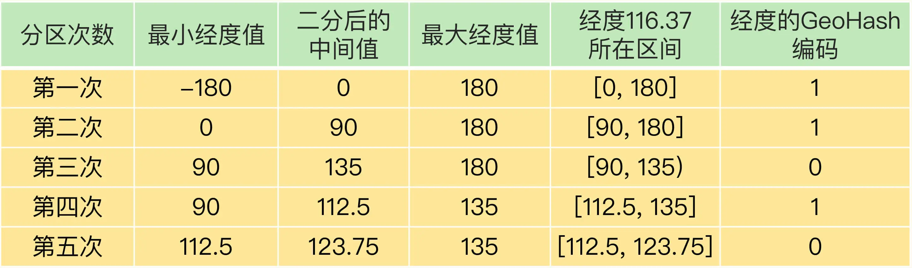

# 数据类型的选择

## String类型内存消耗
### 实际数据存储
* int 编码方式：当保存 64 位有符号整数时，String 类型会把它保存为一个 8 字节的 Long 类型整数
* 简单动态字符串（Simple Dynamic String，SDS）结构：保存的数据中包含字符时
  * buf：字节数组，保存实际数据。为了表示字节数组的结束，Redis 会自动在数组最后加一个“\0”，这就会额外占用 1 个字节的开销。
  * len：占 4 个字节，表示 buf 的已用长度。
  * alloc：也占个 4 字节，表示 buf 的实际分配长度，一般大于 len。

### RedisObject结构体
记录元数据，同时指向实际数据。RedisObject 包含了 8 字节的元数据和一个 8 字节指针。

### 全局哈希表保存所有键值对
哈希表的每一项是一个 dictEntry 的结构体，用来指向一个键值对。dictEntry 结构中有三个 8 字节的指针，分别指向 key、value 以及下一个 dictEntry，三个指针共 24 字节。

Redis 使用的内存分配库 jemalloc。在分配内存时，会根据我们申请的字节数 N，找一个比 N 大，但是最接近 N 的 2 的幂次数作为分配的空间，这样可以减少频繁分配的次数。举个例子。如果你申请 6 字节空间，jemalloc 实际会分配 8 字节空间。

## 数据结构节省内存

### 压缩列表
压缩列表（ziplist），是一种非常节省内存的结构。

* prev_len，表示前一个 entry 的长度。prev_len 有两种取值情况，1 字节或 5 字节。：
  * 取值 1 字节时，表示上一个 entry 的长度小于 254 字节。压缩列表中 zlend 的取值默认是 255，因此，默认用 255 表示整个压缩列表的结束其他表示长度的地方就不能再用 255 这个值了。所以，当上一个 entry 长度小于 254 字节时，prev_len 取值为 1 字节
  * 否则，就取值为 5 字节。
* len：表示自身长度，4 字节；
* encoding：表示编码方式，1 字节；
* content：保存实际数据。

entry 会挨个儿放置在内存中，不需要再用额外的指针进行连接，这样就可以节省指针所占用的空间。

Redis 基于压缩列表实现了 List、Hash 和 Sorted Set 这样的集合类型，这样做的最大好处就是节省了 dictEntry 的开销。当你用 String 类型时，一个键值对就有一个 dictEntry，要用 32 字节空间。但采用集合类型时，一个 key 就对应一个集合的数据，能保存的数据多了很多，但也只用了一个 dictEntry，这样就节省了内存。

### 集合类型
Redis Hash 类型的两种底层实现结构，分别是压缩列表和哈希表。
两个配置项：
* hash-max-ziplist-entries：表示用压缩列表保存时哈希集合中的最大元素个数。
* hash-max-ziplist-value：表示用压缩列表保存时哈希集合中单个元素的最大长度。

一旦从压缩列表转为了哈希表，Hash 类型就会一直用哈希表进行保存，而不会再转回压缩列表了。在节省内存空间方面，哈希表就没有压缩列表那么高效了。

# 数据计算统计

## 聚合统计
统计多个集合元素的聚合结果，包括：统计多个集合的共有元素（交集统计）；把两个集合相比，统计其中一个集合独有的元素（差集统计）；统计多个集合的所有元素（并集统计）。

聚合统计计算复杂度较高，可以从主从集群中选择一个从库，让它专门负责聚合计算，或者是把数据读取到客户端，在客户端来完成聚合统计，这样就可以规避阻塞主库实例和其他从库实例的风险了。
### Set集合
* SDIFFSTORE destination key1 [key2]：返回给定所有集合的差集并存储在 destination 中
* SUNIONSTORE destination key1 [key2]：所有给定集合的并集存储在 destination 集合中
* SINTERSTORE destination key1 [key2]：返回给定所有集合的交集并存储在 destination 中

## 排序统计
集合中的元素可以按序排列
* List：按照元素进入 List 的顺序进行排序的。
* Sorted Set 可以根据元素的权重来排序。

## 二值状态统计
指集合元素的取值就只有 0 和 1 两种。
* Bitmap：Redis 提供的扩展数据类型。可以看作是一个 bit 数组。

## 基数统计
指统计一个集合中不重复的元素个数。
* Set集合：会消耗很大的内存空间。
* HyperLogLog：扩展数据类型，用于统计基数的数据集合类型，它的最大优势就在于，当集合元素数量非常多时，它计算基数所需的空间总是固定的，而且还很小。每个 HyperLogLog 只需要花费 12 KB 内存，就可以计算接近 2^64 个元素的基数。

# GEO扩展数据类型
关键点：记录经纬度信息，并且支持根据经纬度进行范围查找。

GEO 类型的底层数据结构就是用 Sorted Set 来实现。但Sorted Set 元素的权重分数是一个浮点数（float 类型），而一组经纬度包含的是经度和纬度两个值，是没法直接保存为一个浮点数的。所以在此基础上进行了GeoHash 的编码。

## GeoHash 的编码
二分区间，区间编码。

第一次二分区时，经度范围[-180,180]会被分成两个子区间：[-180,0) 和[0,180]。查看一下要编码的经度值落在了左分区还是右分区。在对应分区继续做二分区，当做完 N 次的二分区后，经度值就可以用一个 N bit 的数来表示了。

以定位（116.37，39.86）经纬度为例

计算经度：

计算纬度：

经纬度组合：

用了 GeoHash 编码后，原来无法用一个权重分数表示的一组经纬度（116.37，39.86）就可以用 1110011101 这一个值来表示，就可以保存为 Sorted Set 的权重分数了。

把经度区间[-180,180]做一次二分区，把纬度区间[-90,90]做一次二分区，就会得到 4 个分区。相当于把整个地理空间划分成了四个方格，每个方格对应了 GeoHash 中的一个分区。每个方格覆盖了一定范围内的经纬度值，分区越多，每个方格能覆盖到的地理空间就越小，也就越精准。

# 自定义数据类型

## Redis 的基本对象结构
RedisObject 的内部组成包括了4 个元数据，以及 1 个*ptr指针。：
* type：表示值的类型，涵盖了我们前面学习的五大基本类型；
* encoding：是值的编码方式，用来表示 Redis 中实现各个基本类型的底层数据结构，例如 SDS、压缩列表、哈希表、跳表等；
* lru：记录了这个对象最后一次被访问的时间，用于淘汰过期的键值对；
* refcount：记录了对象的引用计数；
* *ptr：是指向数据的指针。

## 开发一个新的数据类型
* 第一步：定义新数据类型的底层结构
* 第二步：在 RedisObject 的 type 属性中，增加这个新类型的定义
* 第三步：开发新类型的创建和释放函数
* 第四步：开发新类型的命令操作
  
