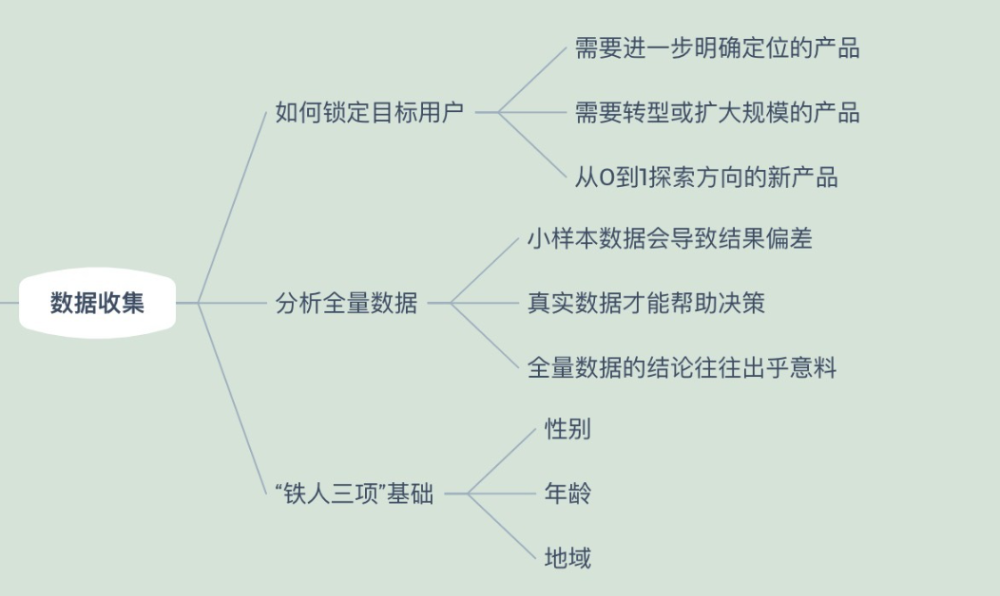
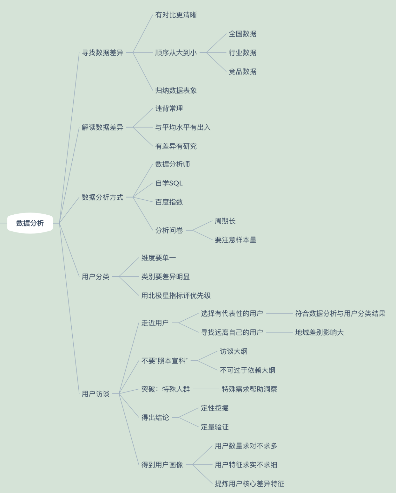
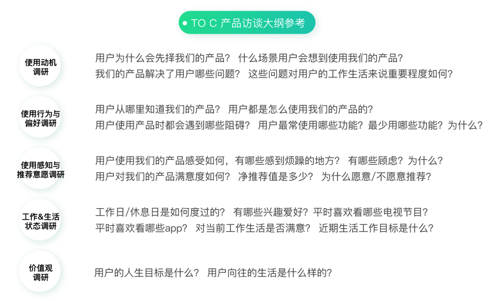
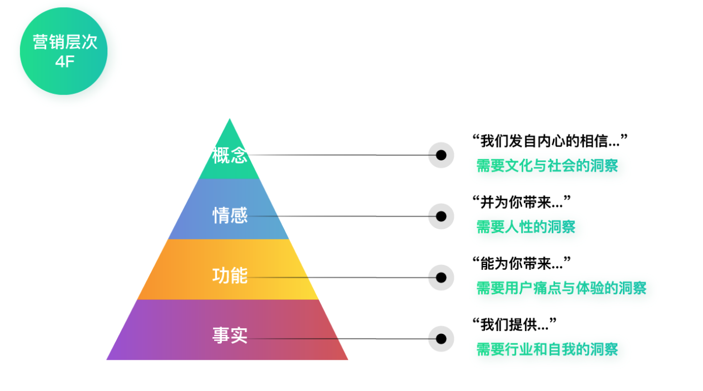
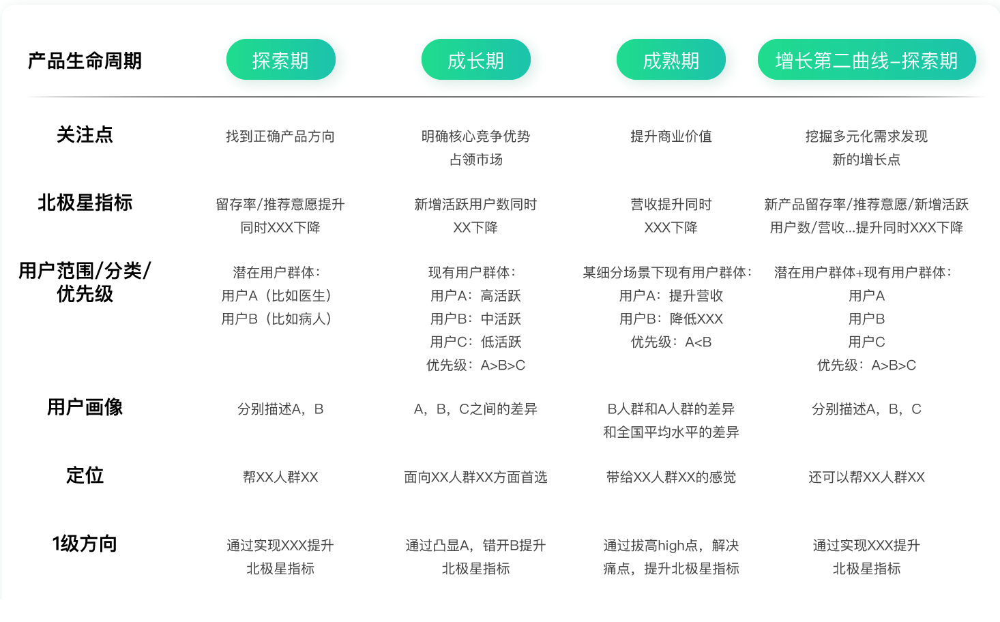
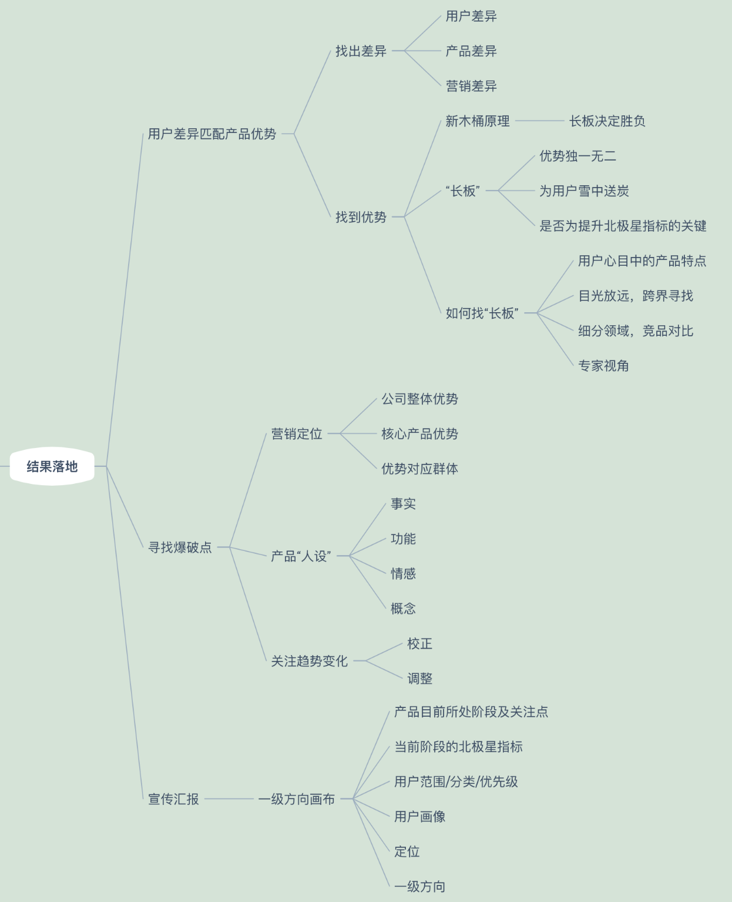
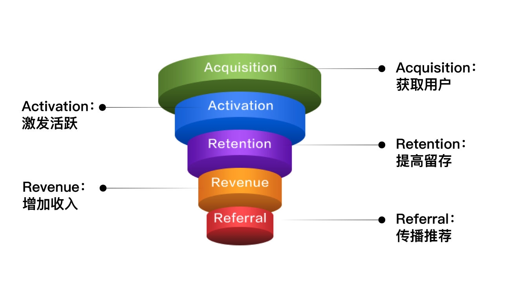
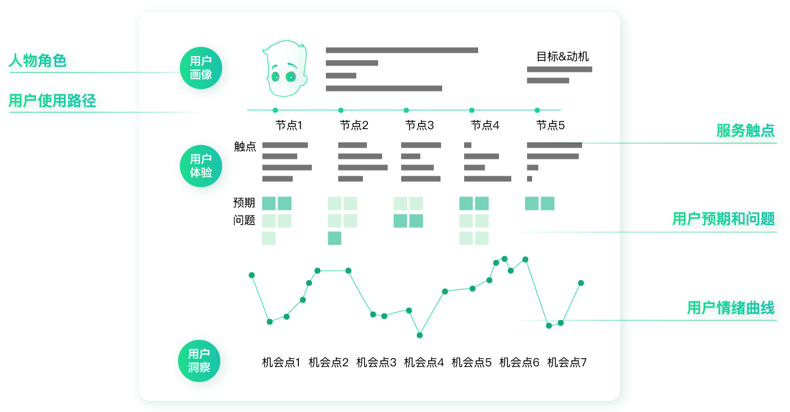
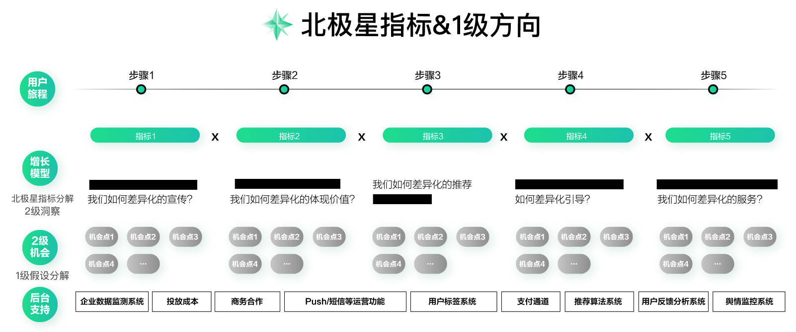

# 目标调研
## 用户调研
* 人群画像指数分析
* 用户留言评论分析
* 了解产品的目标、方向、核心资源及优势、用户等
* 留意行业分析及用户行为报告

## 差异性洞察
> 目标-》数据-》分析-》落地

## 数据分析

### 用户访谈

## 产品定位
每一种差异性定位，都对应着某个特定的群体。探索用户差异性的原因：找到正确的人，提供正确的产品或服务，才能成就正确的产品定位。正确的“定位”是增长的重中之重。

### 寻找产品优势
优势应满足以下条件
* 和竞品相比具有独一无二的优势，且这个优势很难被挑战。
* 对用户来说是雪中送炭而非锦上添花。
* 对于提升北极星指标非常关键。

寻找方式：
* 借用户的眼睛直接找产品长板，特点未必是产品本身的特点，而是你的用户感知到的特点。
* 从用户需求出发跨界寻找长板，从用户的角度看需求，跳出产品现有的框架
* 细分场景后找到竞品寻找长板，在对比中发现差异，竞品的选择以及差异性对比都是非常重要的。
* 专家视角发现产品长板，从自己的优势出发，做别人难以做到的事情。

### 营销定位
> 商业模式-》核心优势-》目标群体

### 一级别方向定位

### 实施

# AARRR模型

* 获取用户： 比如通过线下线上广告推广或福利刺激，让更多新用户下载应用。
* 激发活跃：关注活跃度，DAU（日活）、MAU（月活）、时长、启动次数等指标
* 提高留存：保留一个老客户的成本要远远低于获取一个新客户的成本
* 获取收入：盈利的模式，比如功能付费或者广告。
* 传播推荐：从传播推荐到再次获取新用户，形成了一个螺旋上升的轨迹，优秀的应用在这个过程中不断扩大用户群体，发展得越来越好。

## 现存问题
* 随着人口红利的萎缩，获客成本越来越高了。
* AARRR模型不适用于所有类型的产品。例如一些B端产品
* AARRR过于宽泛，无法起到具体的指导作用。
* AARRR不是线性流程。不完全遵循漏斗的线性规律，更像是五个独立的部分。

# 用户旅程
通过用户旅程分解北极星指标，得到最适合自己产品的增长框架。
## 用户体验地图

* 人物角色：简单的用户画像，以及目标和动机。比如：二三线城市的兼职创业者，需要借几万块用于资金周转。
* 使用路径：比如：看到广告→注册→下载App→选择借款产品→申请借款→放款成功→按时还款。
* 服务触点：这是指用户接触到产品或服务的方式。使用路径上的每一个节点都可能对应着多个触点。比如“看到广告”这个节点，可能对应着电视广告、网络广告、户外广告等多个广告触点。
* 预期问题：比如注册时，用户预期可以看到详细的产品说明，并快速注册通过；而他遇到的问题可能是信息不全不足以帮助他做决策，或者注册流程出现问题等等。
* 情绪曲线：判断用户处在每一个节点中的情绪是高兴的还是愤怒的

## 用户增长地图

* 北极星指标&一级方向：方向的指引作为大前提，重要的战略方向
* 用户旅程&增长指标：用户旅程是用户接触产品或服务的过程，这里要求选择和北极星指标相关的关键路径。
* 二级洞察：从北极星指标分解出来的二级增长指标。
* 二级机会：之前我们结合北极星指标和差异性的用户洞察，得到了一级方向。这里需要结合二级增长指标和二级洞察，得到对应的二级机会。