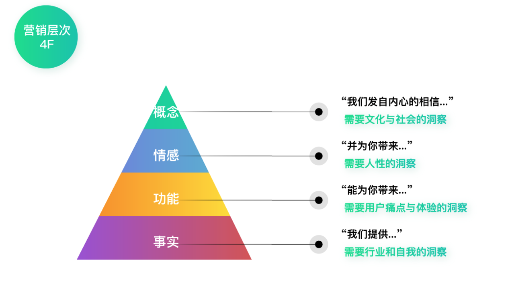

# 增长
> 以用户为中心增长：通过差异性洞察找到增长的爆破点，再配合数据驱动的实验方法，持续地以最小成本创造最大价值。
* 增长黑客：注重数据驱动及小成本快速实验；
* 产品极客：关注创新、洞察力、思维、体验、传播等

# 增长全景图

## 北极星指标（North Star Metric）
又叫OMTM（One Metric That Matters，第一关键指标）。
对应的是公司长远的价值方向，贯穿增长始终。它代表了公司高层对于优先级的判断，判断在企业发展过程中，什么因素是最重要的，该如何衡量。

北极星指标不是目的，而是帮助我们衡量价值并校正方向的工具，最终我们要做到的是通过有针对性的服务用户提升企业的长远价值，这才是目的。

在实际工作中，推荐寻求一组互斥的指标关系作为北极星指标。知道企业的底线，再看企业想要追求的另一端，把握平衡
## 1级方向：差异化定位及增长战略
根据北极星指标寻找自己的增长方向。图中的1级增长方向关乎产品差异性定位、核心竞争优势、具体战略等，是最关键最重要的增长方向。
## 2级机会：全盘考虑发现增长机会
2级增长机会就是贯彻1级增长方向的具体事项。
## 3级增长：打造闭环落地实施增长
选择好增长机会后就可以开始发力实践、落地3级增长了。
## 4级成果：总结增长规律规模复制
积累3级增长过程中的实验结果、摸索规律，把规律运用到其它相关的项目、功能、界面上，最终会带来4级批量增长。

# 目标调研
## 用户调研
* 人群画像指数分析
* 用户留言评论分析
* 了解产品的目标、方向、核心资源及优势、用户等
* 留意行业分析及用户行为报告

## 差异性洞察
> 目标-》数据-》分析-》落地

## 数据分析

### 用户访谈

## 产品定位
每一种差异性定位，都对应着某个特定的群体。探索用户差异性的原因：找到正确的人，提供正确的产品或服务，才能成就正确的产品定位。正确的“定位”是增长的重中之重。

### 寻找产品优势
优势应满足以下条件
* 和竞品相比具有独一无二的优势，且这个优势很难被挑战。
* 对用户来说是雪中送炭而非锦上添花。
* 对于提升北极星指标非常关键。

寻找方式：
* 借用户的眼睛直接找产品长板，特点未必是产品本身的特点，而是你的用户感知到的特点。
* 从用户需求出发跨界寻找长板，从用户的角度看需求，跳出产品现有的框架
* 细分场景后找到竞品寻找长板，在对比中发现差异，竞品的选择以及差异性对比都是非常重要的。
* 专家视角发现产品长板，从自己的优势出发，做别人难以做到的事情。

### 营销定位
> 商业模式-》核心优势-》目标群体

### 实施
