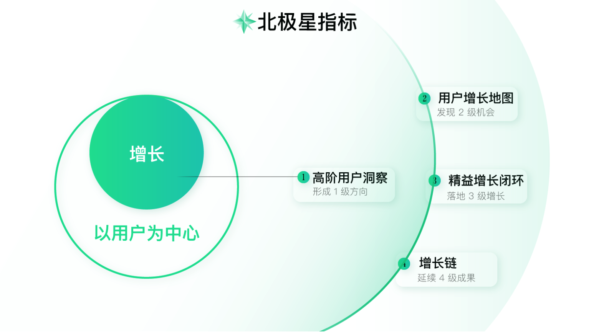
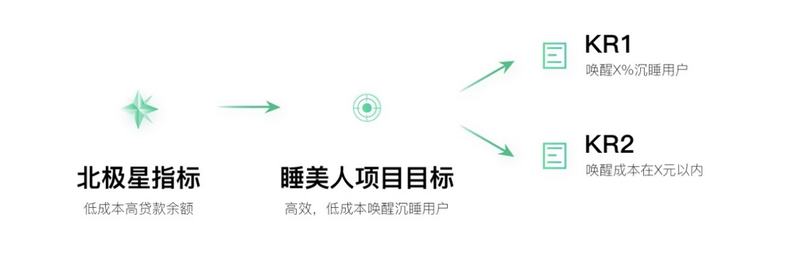

# 增长
> 以用户为中心增长：通过差异性洞察找到增长的爆破点，再配合数据驱动的实验方法，持续地以最小成本创造最大价值。
* 增长黑客：注重数据驱动及小成本快速实验；
* 产品极客：关注创新、洞察力、思维、体验、传播等

# 增长全景图

## 北极星指标（North Star Metric）
又叫OMTM（One Metric That Matters，第一关键指标）。
对应的是公司长远的价值方向，贯穿增长始终。它代表了公司高层对于优先级的判断，判断在企业发展过程中，什么因素是最重要的，该如何衡量。

北极星指标不是目的，而是帮助我们衡量价值并校正方向的工具，最终我们要做到的是通过有针对性的服务用户提升企业的长远价值，这才是目的。

在实际工作中，推荐寻求一组互斥的指标关系作为北极星指标。知道企业的底线，再看企业想要追求的另一端，把握平衡
## 1级方向：差异化定位及增长战略
根据北极星指标寻找自己的增长方向。图中的1级增长方向关乎产品差异性定位、核心竞争优势、具体战略等，是最关键最重要的增长方向。
## 2级机会：全盘考虑发现增长机会
2级增长机会就是贯彻1级增长方向的具体事项。
## 3级增长：打造闭环落地实施增长
选择好增长机会后就可以开始发力实践、落地3级增长了。
## 4级成果：总结增长规律规模复制
积累3级增长过程中的实验结果、摸索规律，把规律运用到其它相关的项目、功能、界面上，最终会带来4级批量增长。

## 围绕北极星指标明确项目OKR

# 参考
* [从 0 开始做增长](https://time.geekbang.org/column/intro/100025001?code=INXSoHDRcMzXQqu8-W0zTTjsczjm1GH7cqj7B6yY8Tg%253D&tab=catalog)