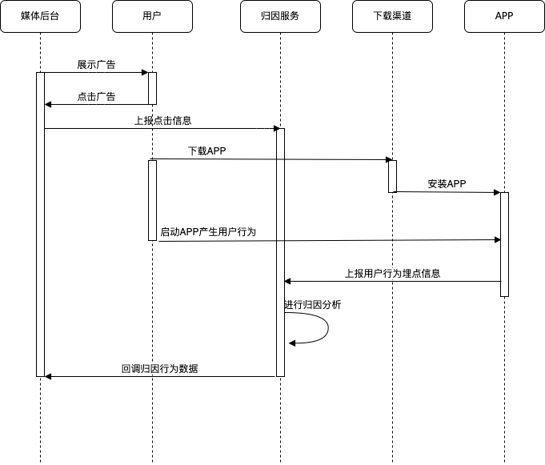

# 归因业务梳理

## 什么是归因

归因是指在特定的时间周期内，如何将销售功劳和转化功劳分配给转化路径中的接触点。

### 接触点

包括浏览、点击及其他互动等，转化之前的每个接触步骤都称之为触点。

* 点击归因(CTR)：通过广告的点击行为来进行归因
* 曝光/播放归因(VTR)：通常是按广告有效播放作为有效的广告触点进行归因。

### 归因窗口期

归因窗口决定了从转化开始回溯多长时间内的广告互动有资格归因功劳，超过这个时长，将不会归因于该广告。不同触点类型、推广活动、转化周期等因素决定归因窗口期。

### 归因匹配模型

指基于归因模型最终将归因结果进行分配的规则。

#### 单触点归因

单点触摸归因主要将转化归功于某一次接触点，该方式简单，便于理解，使用非常普遍

* 首次触点归因：就是把营销功劳全部归功于第一次为网站带来访客的渠道。
    - 优点：有助于你了解人们如何发现品牌知名度进行投资的渠道。
    - 缺点：只考虑最初的品牌认知，忽略其他营销渠道的影响，较为片面。
    - 适用场景：购买决策周期短或新品牌产品
* 末次/最终触点归因：将100%的转化价值归功于客户在进行购买或转化之前与之互动的最后一个渠道。
    - 优点：容易计算，评估，广告平台中最常用的模型。
    - 缺点：该模型忽略了在最终交互之前发生的所有事情。
    - 适用场景：适用于销售周期较短，路径较少的情况。
* 最终非直接点击归因：忽略直接流量，将100%的功劳归于最后一次非直接互动。
    - 优点：通常各种不能准确划分的流量都归类到直接流量，所以直接流量往往具备误导性。
    - 缺点：剥离大量的直接流量，这种归因方式其实也不够准确。

#### 多触点归因

用户在转化只前被多个广告触达，是哪一个广告促成了用户的购买行为? 每个广告对最终转化的贡献率如何评估?这个就是需要多触点归因去解决

* 线上全域归因：
    - 线性归因模型：将功劳平分给转化漏斗中各个不同阶段的触点。
    - 时机衰退模型：第一次互动获得的功劳较少，而最后一次互动获得的功劳最大。
    - 基于位置归因：U型归因、J型归因、反J型归因、W型归因、Z型归因等
    - 数据驱动归因：一种基于机器学习的归因模型，使用所有可用的路径数据，包括路径长度，曝光顺序和广告素材，来了解特定营销接触点的存在如何影响用户转化的可能性以更好地将功劳分配给任何接触点。
    - 自定义归因模型：照自己希望评估的一组假设来定制模型。

## 归因方式

### 匹配式

#### 精准匹配

设备号匹配，就是通过各种ID去匹配，用户在点击广告的的时候获取ID和渠道信息，用户下载安装打开时再次上传ID，然后通过ID匹配就可以知道渠道信息，常用的ID有IMEI、OAID、IDFA等。

- IMEI：国际移动设备设备码，是运营商识别入网设备信息的代码，一种不可重置的永久标识符，但Android 10后禁止获取。
- OAID：匿名设备标识符，由于Android 10后获取不到IMEI，国内 App 和广告跟踪服务急需一种替代方案以避免广告流量的损失，所以国内的移动安全联盟（MSA）联合华为，小米，oppo，vivo等终端厂商推出了OAID，用于逐步取代移动设备原有IMEI码，OAID只有国内在用的一个ID标识
- GAID：谷歌广告 ID， 是一种可由用户重置的标识符，适用于广告用例，依赖Google Play，国内不适用。
- Android ID： 是 Android 设备里不依赖于硬件的一种“半永久标识符”，在系统生命周期内不会改变，但系统重置或刷机后会发生变化，在 Android 8.0 以后，签名不同的 App 所获取的 Android ID是不一样的。
- IDFA: 广告标识符，自2012年iOS6推出后，其他的MAC、UDID各种ID都被苹果禁止，只能用IDFA。iOS 14 后，授权改为在应用级别，每个应用使用都需要通过授权，会导致用户关闭。

#### 模糊匹配

也叫IP+UA，是指通过将用户点击广告时的 IP、User-Agent（简称 UA，用来提取用户的操作系统、版本号、手机型号等信息）信息与激活时的 IP、UA 进行关联匹配实现归因分析。

由于IP和UA会可能会重复，如多个用户使用同一个IP等情况普遍，所以准确率不高

### 传递式

#### 渠道包

具体实现方式就是开发者为每一个渠道生成一个渠道安装包，不同渠道包用不同的渠道标识。当用户下载了 App 之后，AppBuild会随相关的数据发送回来，从而实现渠道的识别。

但对于商店包来说只能定位到应用市场

#### 剪贴归因

用户在广告页面点击下载的时候同时将唯一标识写入剪贴板，用户下载激活后，APP会读取剪贴板的内容，然后将信息上报，实现归因。

由于剪贴板上的信息是用户的隐私信息来的，所以这种方式其实是在侵犯用户的隐私，网信办是禁止的，这种方式严格说是违法的。

#### Install Referrer

应用市场里面存在一个广告参数的传递机制可以实现类似网站的UTM跟踪。华为有智能分包参数。

#### SKAdNetwork

是苹果在2018年推出的保护用户隐私的同时还能实现安装归因的一个方案。但目前有几个问题：1.无法将点击标记和转化精确关联起来。2.无法实时归因有数据延迟。3.需要媒体侧和广告主同时支持。

### UTM
Urchin追踪模块（UTM：Urchin Tracking Modules）用UTM来构建流量统计分析系统（即Google Analytics）。UTM是一组五个查询参数，可以附加到指向我们网站的链接中。

utm 的 5 大元素：
* 来源 (utm_source) ：表示为你带来流量的网站、搜寻引擎或是其他来源，为必填栏位。
* 媒介 (utm_medium) ：表示行销或广告的媒介，像是 Email 、广告组等。
* 名称或推广计划 (utm_campaign) ：表示广告活动的形式，像是某产品的宣传活动名称。
* 字词 (utm_term) ：常见于 Google 付费关键字广告所使用的字词或是连结名称/图片的替代文字。
* 内容 (utm_content) ：表示连到同一个网址的不同广告或是连结。

## 广告归因流程

## 站内归因

- 用户多次搜索不同的产品后带来的转化在不同搜索词之间分配
- 网站内部有促销活动评估，不仅要从广告位的展示和点击，还要从不同广告位带来的转化数据角度去分析
- 订单的产生类型繁多，如何通过站内广告位产品，站内搜索，站内类别产生，推荐等进行评估也需要归因

# 参考
* [Google Analytics经验分享平台](https://www.ichdata.com/google)