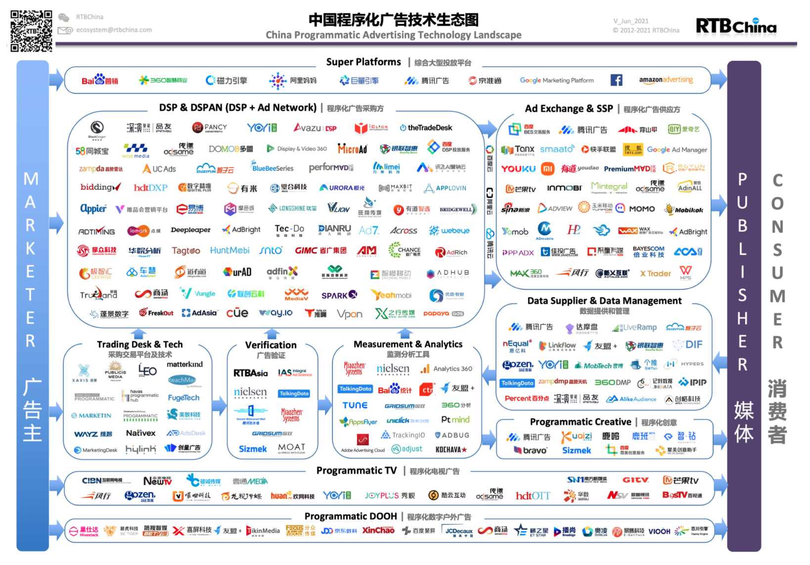
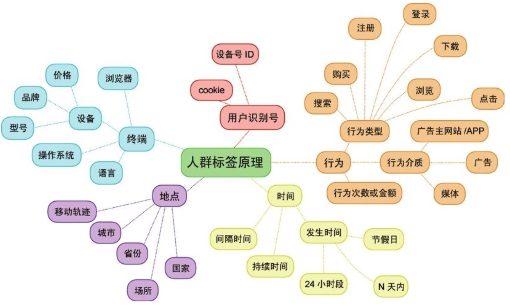
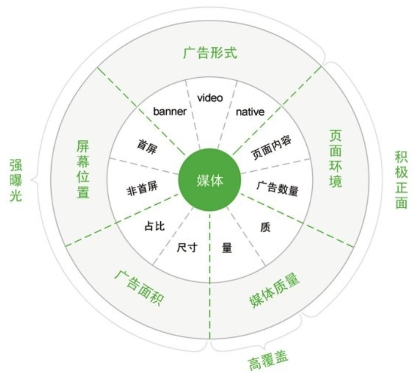
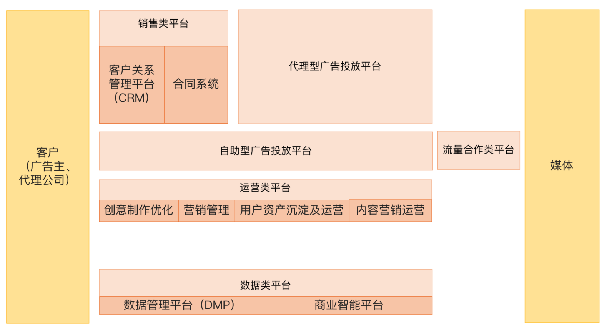
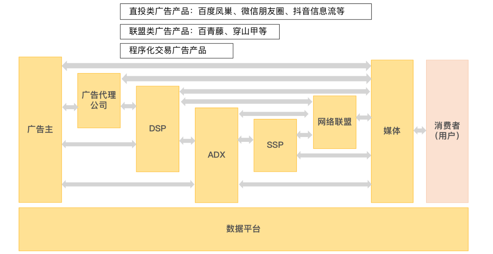

# 程序化广告
程序化广告的核心在于五大正确要素：在正确的时间和正确的场景，通过正确的方式，将正确的商品展示到正确的用户面前。

程序化广告定义：是指利用技术手段进行广告交易和管理的一种广告形态。以人为本的精准广告定向，媒体资源的自动化、数字化售卖与采购。
## 名次解释
* 媒体平台（也叫发布商）：在自己的服务里提供广告的内容服务商
* 广告主：愿意把自己的广告放到发布商上来显示给受众观看的服务提供商。
* 广告代理：广告主的代表，来和媒体平台打交道，进行广告产品的采购和投放的公司。

需求方服务：
* 需求侧平台，简称DSP（Demand Side Platform）：聚合了多家广告主的程序化交易广告采购需求及预算，代表广告主及其代理公司进行程序化交易广告的采买，针对每一次广告曝光决定是否竞拍，以及如果参与竞拍，如何向ADX出价。广告需求方可以通过DSP管理广告活动和投放策略，包括设置目标受众的定向条件、预算、出价、创意等。你可以把DSP看作拍卖现场的买方，也就是“竞拍方”。程序化交易中，ADX一般会接入多个DSP。DSP主要关注点如下：
  * 媒体资源：DSP媒体资源的优势，包括特色媒体、广告类型和量级等。
  * 技术能力：包括DSP功能模块以及硬件设备
  * 数据实力：是否有足够的数据实力可以支持广告的精准投放
  * 算法能力：法优化模型，帮广告主实现广告的自动调整和优化
  * 产品后台：广告投放后台的完整性、成熟度、稳定性、易用性等。
  * 服务能力：DSP执行团队的专业性（包括数据分析能力、报表输出能力、应急服务能力等
  * 收费模式：媒体价格、服务费用以及收费透明性也是广告主评估的一个关键点。
 * 采购交易平台，简称TD（Trading Desk）：主要是满足需要管理多个DSP广告投放的代理公司的需求。公司可以通过TD统一管理多个DSP平台的投放，包括分配投放预算、制定和调整投放策略、查看数据报告等。你可以把TD看成程序化交易需求方的工作台。TD除了广告代理公司自建之外，媒体平台也会为代理公司建立TD

流量供应方：
* 广告联盟，简称ADN（Ad Network）：媒体代理公司，通过为广告主采购媒体方流量，赚取中间差价，其代表有百度网盟等。提高了广告主的媒体购买效率

流量方服务：
* 供应侧平台，简称SSP（Supply Side Platform）：聚合了各种媒体方及广告联盟的流量，针对每一次广告曝光向ADX发送请求，并在ADX回复竞拍结果后，展现竞拍成功方的广告。你可以把SSP看作拍卖现场的“卖方”，ADX也会接入多个SSP。
* 广告交易平台，简称ADX（Ad Exchange）：是负责多个SSP和需求侧平台进行匹配的中间平台，是程序化交易广告的核心平台型产品，负责程序化交易广告每一次曝光的实时拍卖过程，主要按照价格决定哪个竞拍方竞得这次广告曝光。你可以把它看作“拍卖官”。提升广告填充率、售卖单价和售卖效率。

广告服务与数据管理：

广告服务不提供竞价服务，主要是帮助广告主投放广告、衡量并优化广告效果。包含监测分析、程序化创意、广告验证；数据管理主要为广告主提供数据收集、清洗、生成标签等。

* 程序化创意平台（Programmatic Creative Platform，简称PCP）：专注于广告创意的投放优化，通过技术自动生成海量创意，并利用算法和数据对不同受众动态地展示广告并进行创意优化
* 广告验证平台（Ad Verification Platform）：通常也是为品牌广告主服务，为其提供广告投放过程中的品牌安全、反作弊、可视度、无效流量验证等保障，通过分析投放媒体的内容合法性、正面性，为品牌广告的投放提供和谐健康的媒体环境。
* 数据管理平台，简称DMP（Data Management Platform）：为广告投放提供人群标签进行受众精准定向，并通过投放数据建立用户画像，进行人群标签的管理以及再投放。DMP分为三种归属。
  * 第一方DMP：指大型广告主自己搭建或者寻找外部技术提供商为自己搭建的内部DMP，用于分析和管理用户数据，为营销环节提供决策支撑和用户数据支撑，广泛应用于电商、游戏、旅游等行业。
  * 第二方DMP：指需求方服务提供者（一般是指DSP）搭建的DMP，旨在帮助广告主更好地进行投放，在提升效果的同时加大投放量，间接提升广告主在需求方平台的投放额度。将自己库里的用户标签和SSP通过ADX传递过来的用户标签进行对比，判断此次广告曝光背后的受众是否是自己库里广告主的目标用户，来决定是否竞拍以及出价多少。
  * 第三方DMP：指以数据交易为主要形式的DMP，为需求方提供数据交换、售卖等服务。通常需要对接入DSP后再运用到广告投放中。
* 监测分析平台（Measurement & Analytics Platform）：例如广告数据监测公司。评估广告投放平台数据的真实性，验证投放的数据如展示量、点击量、受众属性等是否与第三方监测报告一致。
  

## 广告类型
* 邮件广告，EDM，Email Direct Marketing；
* 横幅广告，banner，形为横长矩形；
* 按钮广告，button，形为正方形，高于横幅广告；
* 搜索广告，SEA，Search Engine Advertising；
* 弹窗广告，Pop-up Ads；
* 富媒体广告，Rich Media；
* 视频广告：贴片 、暂停、角标
* 原生广告，信息流等
* 全屏、插屏、开屏、退屏、锁屏
* 激励广告、推荐广告
* 其他广告形式，如文字链广告、社交广告等等。

## 广告提案
重点要分析广告投放目标和KPI需求。以人为中心，根据品牌信息找准TA（目标受众），围绕**用户旅程**中的各个**接触点**，基于数据进行**消费者洞察**，并根据**用户生命周期**中不同阶段的特性，为广告主制定合理的媒体渠道策略和个性化的创意内容策略。

## 广告策划
### 人群策略
#### 老用户
* 普通重定向：对站内不同行为人群标签展示差异性广告创意，进行用户召回。
* 个性化重定向：根据每一个用户的不同行为推送个性化广告，以提升访客召回的效果。
#### 新用户
* 基础定向：地区、设备、客户端定向等
* 人群标签定向：社会化属性、兴趣爱好、购买倾向、广告主自定义人群包等

* Look Alike: 相似人群扩展，根据重定向用户作为种子用户，根据特征查找相似特性人群
* 搜索词用户：通过搜索词进行用户定向投放

#### 4W1H
* Who-谁：用户属性
* When-何时：用户行为对应的时长
* Where-哪里：用户的来源
* What-做了什么：用户的行为
* How-如何：用户质量如何

### 媒体策略

## 数据分析优化
### 数据分析
* 维度指标分析：时间、维度、指标
* 分析数据方法：对比、细分、归因
### 广告优化
* 曝光：媒体优化、创意优化、频次控制、人群调整、可见曝光优化
* 点击：点击率优化、点击到达率优化
* 转化：页面内容优化、转化体验优化
## 媒体平台
### 用户互动模式变化
#### Web 1.0
* 搜索引擎：例如百度、谷歌、搜狗等，根据用户输入的关键词给出结果，内容的排序结果是由搜索引擎平台决定的；
* 门户网站：例如新浪、搜狐、腾讯网等通用门户网站，还有凤凰网、汽车之家等垂直门户网站，网站平台向用户展现由广告主和平台沟通后的广告；
* 视频网站：优酷、土豆、爱奇艺、腾讯视频等，网站平台在版权内容前、中、后展现贴片、角标等各种形式的视频广告。

#### Web 2.0
* 社交类网站和App：例如微博、微信、陌陌等
* UGC（用户生成内容）型网站和App：例如哔哩哔哩、抖音、快手等。
* 电商等完全在线完成用户购买与服务闭环的网站与应用：例如淘宝、美团等

#### 趋势
* 广告产品的媒介终端由智能手机+移动互联网拓展到车联网、物联网：随着5G、智能硬件、智能座舱等技术与应用的发展
* 广告产品的媒介形式会有新的变革：因为媒介终端和互联网技术的进化，所以媒介形式也会从视频继续进化。（例如：虚拟现实）
* 广告产品的用户互动形式会进一步进化：随着媒介终端和媒介形式的革新，用户的操作也将不再局限于手部动作，会出现更多身体部位的互动，也会诞生很多新的、有趣的互动玩法，广告会和用户的生活联系地更加紧密。
* 广告产品的内容呈现逻辑可能会出现混合的趋势：精准定向广告在未来相当长的一段时间内依然是主流，所以数据、策略、建模、算法依然是很重要的改进方向。但是随着内容合规和用户数据隐私保护意识的普及，以及相关法规政策的出台，未来有关部门和用户个人对于内容呈现都会有很多的掌控权，用户将拥有更多的自主权，选择是否接受需要使用用户数据的精准定向广告。

### 媒体产品广告体系

#### 自有流量+外部合作流量

自有流量平台的产品，为什么都会纷纷发展出外部合作流量的平台广告产品。
* 流量发展到一定程度会保持在一个比较稳定的状态
* 拓展流量池子，从广告主那里争取更多的预算

外部流量的拥有者为什么不自己售卖
* 不是所有App都拥有经验丰富的广告产品售卖团队
* App在广告主那里关注度和预算分配的优先级也远远低于阿里巴巴、字节跳动这些头部企业。
* 广告资源还有一个很大的特点，它和飞机、高铁的舱位一样，具有时效性。未能出售的时段只能白白浪费，所以要提高自己的广告售出率，

#### 按与用户的互动关系分类
* 搜索类广告：用户输入搜索关键词后才会出现的广告，例如百度的搜索关键词广告、阿里巴巴的淘宝直通车广告、抖音的搜索广告等；
* 展示类广告：用户只要浏览就会出现的广告，例如手机端常见的开屏广告、信息流广告，网页端常见的横幅广告、按钮广告、弹窗广告、富媒体广告，视频内容中常见的前、中、后贴片广告等等；
* 互动类广告：用户可以进行深层互动的广告，会以社交或者直播类产品的形式呈现给我们，例如阿里妈妈的超级直播，字节跳动旗下FaceU的定制贴纸等等。

## 广告产品发展路线
* 拥有了成功的用户产品，日活较高，所以也拥有比较高的广告可用流量。
* 在用户和广告主侧都具有了一定的品牌认知度，推出的广告产品容易被广告主认可。

### 开发自有流量上的直投类广告产品
自己的投放平台进行投放的广告产品。
* 展示类广告：指主要满足广告主品牌推广或者其他高曝光量需求的广告产品，一般尺寸较大，位置明显。例如腾讯的微信朋友圈广告、阿里的品牌特秀、百度的品牌专区、字节的抖音开屏广告等。
* 效果类广告：指主要满足广告主效果转化需求的广告产品，转化事件由广告主定义，包括App的下载及激活、用户参加活动、购买商品等。这类广告形式多样，位置不限，例如腾讯的微信公众号底部广告、阿里的淘宝直通车、百度的搜索广告、字节的抖音DOU+等。

### 开发合作流量上的联盟类广告产品
联盟类产品是以外部合作流量为主的聚合类广告产品。联盟类广告产品因为主要以CPC按照点击计价的付费方式为主，所以一般被看作是效果类广告产品，和自有流量上的效果广告一样，通过自助投放平台进行售卖。

联盟类广告产品不仅可以增加大厂供给侧的流量供给，还可以为大厂争取更多的广告预算。

### 搭建程序化广告交易平台

程序化广告交易平台是基于实时竞价技术的广告交易平台类产品，主要涉及实时竞价这个关键技术以及三个基本的平台，分别是服务于广告主和广告代理公司的DSP、服务于媒体方的SSP以及连接两个平台的ADX，也会涉及一些其他的产品，例如DMP（数据管理平台）、Trading Desk（采购交易平台）等等。

## 广告收入和用户体验

### 原生广告
指的就是长得和App或者网页上原本的非广告内容或者功能模块非常像的广告产品。用户刷到的时候不会觉得很突然。
* 形式原生视频广告：原生信息流视频广告、原生压屏条、原生角标、边看边买等。形式原生视频广告属于标准广告产品，一般由广告业务团队负责设计、开发上线，然后进行规模化售卖。常用结算方式CPM和CPC为主
* 内容原生视频广告：冠名、联合赞助、口播、植入、创意中插、定制视频。内容原生视频广告属于非标准广告产品，由内容营销团队和广告主通过项目制进行谈判和售卖。常用结算方式CPT和定制价格为主

> 广告加载率：也叫做Ad load，指一段时间内，用户人均看到的广告数/人均看到内容数。例如，在信息流产品中，广告加载率=人均看到的广告数÷人均看到的feed数。
>
为了照顾用户体验，一般信息流广告的广告加载率不超过10%，也就是最多每10条内容夹杂一条广告。
  
### 频次控制
控制一个用户最多在指定时间内看到一个广告（或相似广告）的次数，通常指的是同一个广告主在一定时间段内向同一个用户展现同一个广告创意的频次

* 增加触达用户数量
* 提高广告点击率和转化率

### 激励视频
将5-30秒的视频广告与App使用场景以及用户权益相结合的一种广告形式，简单来说，就是用户通过观看视频广告获得相应奖励或用户权益。

* 给广告主、流量主、用户带来了多方共赢的可能，尤其是直接兼顾到用户的利益。
* 把看广告的选择权交给了用户
* 可以为将来的广告设计提供更多数据依据：用户和激励视频广告的交互行为比其他类型的广告更丰富更多维，例如是否点击观看广告、什么区域/什么形式的广告接受度高、哪种权益最能激励用户观看广告……这些数据都是后续优化激励视频广告产品设计的重要依据。

## 广告产品需求调研

### 调研流程

* 明确项目目标
* 梳理流程与分工
* 确认项目逻辑
* 设计调研问卷
* 约访调研对象
* 梳理调研对象需求
* 产出解决方案
* 各部门分头跟进

### 调研目标对象
* 客户行业
* 营销目标
* 营销场景
* 客户规模
* 客户区域

## 物料

能体现出广告的所有材料就叫做广告物料。互联网广告的物料是广告内展现的内容。广告物料可以清晰地传达品牌和产品的信息，好的广告物料可以显著提升点击率。

### 程序化创意平台
由数据和算法驱动，通过对广告创意内容进行智能制作和创意优化，从而整合互联网创意产业上下游的技术。
* 人工智能：通过预先设定的算法和流程，程序化创意平台可以快速产出成千上万个细分版本的广告群组，并在投放过程中智能决策、优化创意组合。
* 整合工作流：利用程序化技术，将传统被置于线下的创意生产整合进入互联网营销工作流，实现创意与媒介的闭环。

## 程序化交易广告

### 交易过程
  1. 用户浏览媒体，媒体通过JS、SDK或API，向ADX发起广告请求。这一步，媒体可以通过SSP或网络联盟的系统联系ADX，也可以直接联系ADX。如果媒体通过SSP联系ADX的情况，SSP除了向ADX发出广告请求外，还需要把广告位的具体信息、例如所属媒体、最低出价，以及该次广告曝光针对的用户标签，打包发给ADX。
  2. ADX向各DSP传送以上媒体和用户标签等信息，并发起询价请求。DSP根据事先做好的各广告主所需要的用户标签等信息，查看与此次广告曝光是否匹配，决定是否参与竞价。如果参与，DSP会向ADX提供自己的出价。ADX等待一个固定时间后，会选出出价最高的DSP返回给媒体。
  3. 媒体展示竞价中胜出的DSP的广告创意。该广告创意可能实时来自DSP，但是一般ADX会事先把DSP提供的素材存储在素材库中。这时候根据媒体的广告位尺寸、格式要求渲染后提供即可。

### 优势
* 从“买广告位”变成“买人”，实现精准投放
* 提升广告产品交易的效率：广告主可以在DSP中确定需要的用户及媒体标签，对广告购买掌握更多的自主权，并且通过ADX连接SSP、网络联盟和终端媒体，更有效地分配预算。
* 提升长尾流量的广告填充率：媒体在向ADX发起广告请求时，可以一并发送广告位底价，这就帮助长尾流量、剩余流量进入到广告主的采购视野中。

### 程序化交易与广告产品效果的关系
媒体或者ADX需要向DSP开放足够丰富的用户标签，用户数据是一个极其敏感的领域，所以媒体绝不会轻易对外开放自己的用户标签。

自家平台上的广告，最终都是通过第三方DSP拍卖出去的话，自己也很难掌握到广告主等需求侧的数据，难以进一步提升广告填充率和eCPM，媒体平台也纷纷建立起自家的DSP。这就导致ADX+DSP，成为大厂程序化交易广告平台的标配。

媒体平台利用自己的数据优势，搭建起了自己的DMP数据管理平台。广告主还可以和媒体平台的DMP合作，上传自己的CRM用户数据，通过媒体平台的DMP给这些用户打上更多标签，再结合Lookalike技术进行人群拓展后，在媒体平台上投放广告。经

### 发展趋势
* 聚焦头部平台：成功的广告产品首先还是要依赖于大规模的流量与用户。
* 交易模式的细分
  * 公开竞价：ADX对需求方和供给方都是开放的状态，所有的DSP同时拥有竞拍每一次广告曝光的权利
  * 私有竞价：有些优质媒体为了自身收益和品牌安全，只邀请部分广告主参与竞价，会优先把流量放到私有竞价中进行拍卖，剩余流量再给公开大厅。
  * 程序化直接购买：买卖双方按照协商好的价格或流量，绕开竞价，直接进行一对一交易。这种交易模式又可以分成两种方式：优先交易和程序化保量。
    * 优先交易（Preferred Deals，PD）：保价不保量，买卖双方协商好固定价格进行交易，这个价格一般高于公开竞价的价格；
    * 程序化保量：一般有两种，一种是依照双方约定好的量100%采购，另一种是依照约定的返量比例来进行采购，例如媒体按照广告主所需比例的1.5倍推送流量，广告主将多余的流量返还，CPM价格则跟广告主所需流量的数量和返量比例有关。

* 细分工具型产品的发展：例如Marketing API和Real Time API

# 广告验证
## 反作弊
### 作弊环节
* 曝光环节
* 点击环节
* 转化环节
### 作弊方式
* 假用户：不断变换IP或设备伪装不同用户点击广告
* 真用户假流量：利用真实设备。常见手段：广告堆叠、归因作弊、植入不可见的广告位置、肉机刷广告。作弊平台只需要向广告主的点击服务发送用户的设备号ID即可，该用户一旦产生激活注册行为，这部分转化用户就直接成为作弊平台的功劳了。
* 真用户真流量：用劣质流量滥竽充数卖高高价；表现二是通过http或者DNS进行流量劫持。

### 作弊现象
可离线解决的作弊如下。
* 一个cookie对应超过N个IP或设备ID。
* 一个设备ID对应N个以上IP或userAgent。
* 点击的refererurl包含display_ad.php。
* 有点击无曝光的IP。
* 点击率异常的IP和设备ID（如：移动端大于10%或PC端大于6%且点击量大于30）。
* 广告位的曝光或点击集中在少量IP、cookie或者设备ID，可能是作弊广告位。
* 页面停留时间大于平均水平。
* PC端平均窗口大小指标小于70万像素或大于110万像素，或移动端PC端平均窗口大小指标小于1万像素或大于50万像素。

可实时解决的作弊如下。
* 某个cookie在N分钟内使用的IP超过N个。
* 某个cookie在N分钟内点击超过N次。
* 所有userAgent出现java、python关键字直接拉黑。”

### 反作弊
* 用户标识：IP、设备ID等
* 用户行为：广告浏览或点击；用户的后续行为。
* 广告来源

## 常思考
* 广告产品的流量与效果的天花板
* 广告变现与用户体验之间的矛盾
* 广告产品与其他变现模式之间的矛盾

# 参考
广告章节所有笔记均有参考下方相关链接，后续笔记中不再一一列举

* [大厂广告产品心法](https://time.geekbang.org/column/intro/100107801)
* [27个程序化广告必懂名词](https://mp.weixin.qq.com/s?__biz=Mzg5NjEyMDI1NQ==&mid=2247483754&idx=1&sn=77a495a35210877b1677e8d09b46269d&chksm=c004a5baf7732cacebef889c8497216d7d39175369cfd53e653ff239ecd5ccb40e78912bf242&scene=21#wechat_redirect)
* [计算广告：互联网商业变现的市场与技术](https://cread.jd.com/read/startRead.action?bookId=30822114&readType=1)
* [广告相关推荐书籍](https://www.ichdata.com/several-books-on-programmatic-advertising-and-advertising-technology.html)