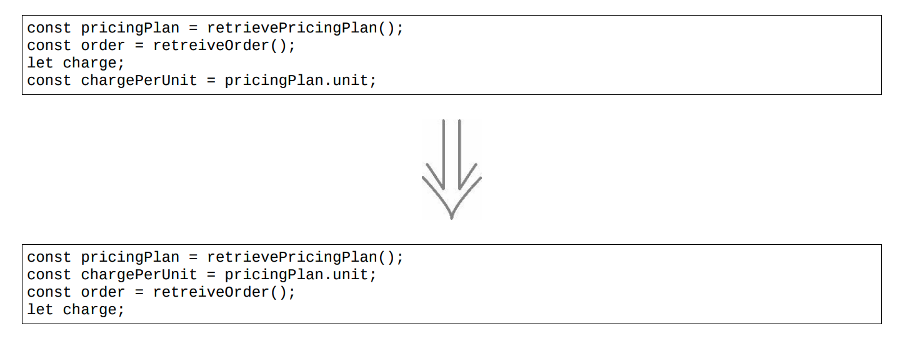
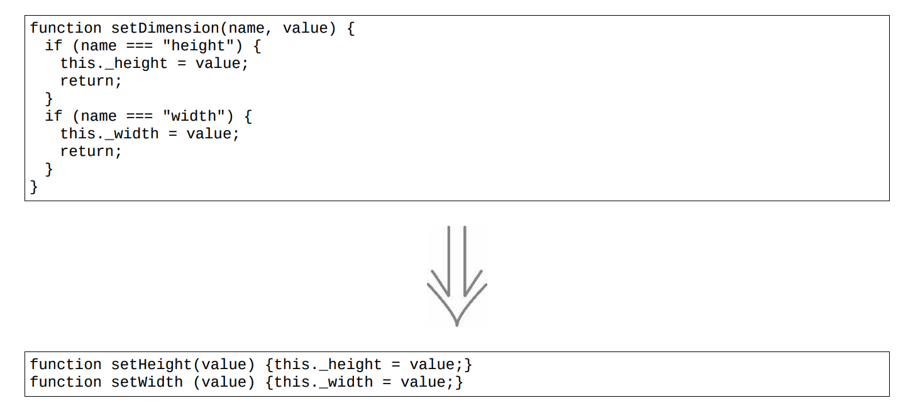
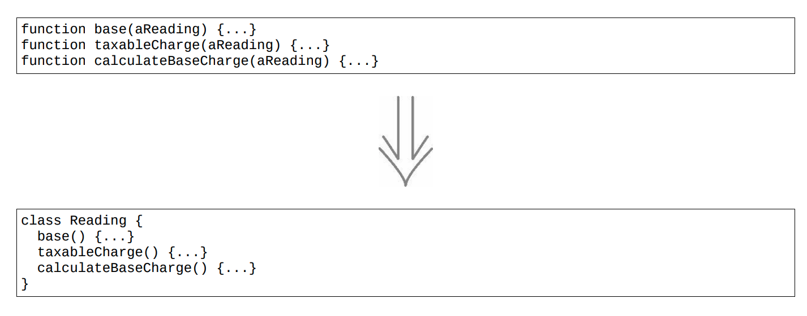
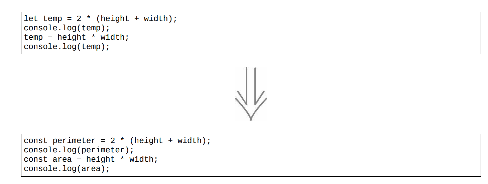

# CodeReviw中的问题

## 代码中的坏味道

### 变量命名不规范

> 好的代码本身就是注释，我们要尽量规范和美化自己的代码来减少不必要的注释

[命名格式参考](https://www.cnblogs.com/liqiangchn/p/12000361.html)

[命名神器](https://unbug.github.io/codelf/)

### 重复代码

两个方法中存在相同的逻辑

* 提炼函数：将重复的代码复制到新的函数中，将引用的局部变量通过参数传递

重复代码只是相似而不是完全相同

* 移动语句：让存在关联的东西一起出现

### 过长函数

> 小函数如果有良好的命名很易于理解，如果一段代码需要用注释解释清楚的时候就可以考虑将其抽成一个独立的函数，通过函数命名来解决。

函数内有大量的参数和临时变量，提炼函数就会很麻烦

* 以查询取代临时变量：getValue()
* 引入参数对象：传递结构体

循环

* 循环内的代码提炼到一个独立的函数中

条件表达式

* 以多态取代条件表达式
* 每个分支都应该通过提炼函数变成独立的函数调用

### 过长参数列表

> 过长的参数列表会让人更加迷惑

* 以查询取代临时变量

* 引入参数对象

* 移除标记参数
  

* 函数组合成类：当多个函数有同样的几个参数可以使用

  

### 全局数据

> 从代码库的任何一个角落都可以修改它，而且没有任何机制可以探测出到底哪段代码做出了修改。容易引发bug

* 封装变量：用函数封装，控制变量的作用域

### 可变数据

> 对数据的修改经常导致出乎意料的结果和难以发现的 bug，在一处更新数据，却没有意识到软件中的另一处期望着完全不同的数据

* 封装变量
* 拆分变量:
