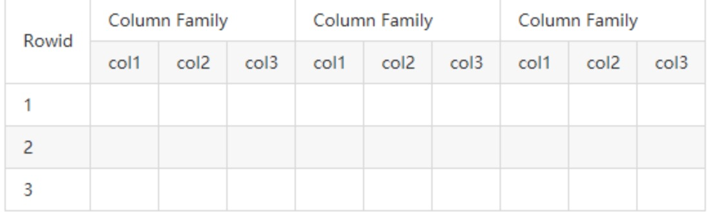

# 介绍
> 非关系型分布式数据库，是建立在Hadoop文件系统之上的面向列的分布式数据库。

Hadoop只能执行批处理，并且只能按顺序访问数据，意味必须搜索整个数据集。
Hbase的诞生目的是为了提供对大量结构化数据的快速随机访问。


# 安装
> 前提安装 ZooKeeper
## Docker
拉取镜像
```shell
docker pull harisekhon/hbase:latest
```
启动容器
```shell
sudo docker run -d -h docker-hbase \
 -p 12181:2181 \
 -p 18080:8080 \
 -p 18085:8085 \
 -p 19090:9090 \
 -p 19000:9000 \
 -p 19095:9095 \
 -p 16000:16000 \
 -p 16010:16010 \
 -p 16201:16201 \
 -p 16301:16301 \
 -p 16020:16020\
 --name hbase \
 harisekhon/hbase
```
配置服务器hosts文件(zookeeper 里使用的是 docker-hbase 这个地址)
```shell
127.0.0.1 docker-hbase 
```
进入容器
```shell
docker exec -it <container ID前缀> bash
```
启动thrift2
```shell
/hbase/bin/hbase-daemon.sh start thrift2
```
使用[HBase Shell](https://hbase.apache.org/book.html#shell)
```
hbase shell
```
进入Hbase WebUI
```url
http://localhost:16010/master-status#userTables
```
日志目录
```shell
cd /hbase/logs
```

# 原理
## 架构

HBase 系统遵循 Master/Salve 架构，由三种不同类型的组件组成：

### Zookeeper
1. 保证任何时候，集群中只有一个 Master；
2. 存贮所有 Region 的寻址入口；
3. 实时监控 Region Server 的状态，将 Region Server 的上线和下线信息实时通知给 Master；
4. 存储 HBase 的 Schema，包括有哪些 Table，每个 Table 有哪些 Column Family 等信息。

### Master（主服务器）
1. 为 Region Server 分配 Region ；
2. 负责 Region Server 的负载均衡 ；
3. 发现失效的 Region Server 并重新分配其上的 Region； 
4. GFS 上的垃圾文件回收；
5. 处理 Schema 的更新请求。

### Region Server（区域服务器）
1. Region Server 负责维护 Master 分配给它的 Region ，并处理发送到 Region 上的 IO 请求；
2. Region Server 负责切分在运行过程中变得过大的 Region。一个 Region 包含表中所有 Row Key 位于 Region 的起始键值和结束键值之间的行。每一个 Region 的默认大小为1GB。
3. 每一个 Region Server 大约可以管理1000个 Region。

#### Region Server 组成
* WAL：既Write Ahead Log。WAL是HDFS分布式文件系统中的一个文件，即HLog。WAL用来存储尚未写入永久性存储区中的新数据。WAL也用来在服务器发生故障时进行数据恢复。
* Block Cache：Block cache是读缓存。Block cache将经常被读的数据存储在内存中来提高读取数据的效率。当Block cache的空间被占满后，其中被读取频率最低的数据将会被杀出。
* MemStore：MemStore是写缓存。其中存储了从WAL中写入但尚未写入硬盘的数据。MemStore中的数据在写入硬盘之前会先进行排序操作。每一个region中的每一个column family对应一个MemStore。
* Hfiles：Hfiles存在于硬盘上，根据排序号的键存储数据行。

#### META Table
ZooKeeper中会保存META table的位置。META table中保存了HBase中所有region的信息，格式类似于B tree。其结构如下：
* 键：region的起始键，region id。
* 值：Region server


### 组件间的协作
HBase 使用 ZooKeeper 作为分布式协调服务来维护集群中的服务器状态。 Zookeeper 负责维护可用服务列表，并提供服务故障通知等服务：

+ 每个 Region Server 都会在 ZooKeeper 上创建一个临时节点，Master 通过 Zookeeper 的 Watcher 机制对节点进行监控，从而可以发现新加入的 Region Server 或故障退出的 Region Server；

+ 所有 Masters 会竞争性地在 Zookeeper 上创建同一个临时节点，由于 Zookeeper 只能有一个同名节点，所以必然只有一个 Master 能够创建成功，此时该 Master 就是主 Master，主 Master 会定期向 Zookeeper 发送心跳。备用 Masters 则通过 Watcher 机制对主 HMaster 所在节点进行监听；

+ 如果主 Master 未能定时发送心跳，则其持有的 Zookeeper 会话会过期，相应的临时节点也会被删除，这会触发定义在该节点上的 Watcher 事件，使得备用的 Master Servers 得到通知。所有备用的 Master Servers 在接到通知后，会再次去竞争性地创建临时节点，完成主 Master 的选举。


## Hbase Table 

### 1.1 Row Key (行键)

`Row Key` 是用来检索记录的主键。想要访问 HBase Table 中的数据，只有以下三种方式：
+ 通过指定的 `Row Key` 进行访问；
+ 通过 Row Key 的 range 进行访问，即访问指定范围内的行；
+ 进行全表扫描。

`Row Key` 可以是任意字符串，存储时数据按照 `Row Key` 的字典序进行排序。这里需要注意以下两点：

+ 因为字典序对 Int 排序的结果是 1,10,100,11,12,13,14,15,16,17,18,19,2,20,21,…,9,91,92,93,94,95,96,97,98,99。如果你使用整型的字符串作为行键，那么为了保持整型的自然序，行键必须用 0 作左填充。
+ 行的一次读写操作是原子性的。

### 1.2 Column Family（列族）
HBase 表中的每个列，都归属于某个列族。列族是表的 Schema 的一部分，所以列族需要在创建表时进行定义。列族的所有列都以列族名作为前缀，例如 `courses:history`，`courses:math` 都属于 `courses` 这个列族。

### 1.3 Column Qualifier (列限定符)
列限定符，你可以理解为是具体的列名，例如 `courses:history`，`courses:math` 都属于 `courses` 这个列族，它们的列限定符分别是 `history` 和 `math`。需要注意的是列限定符不是表 Schema 的一部分，你可以在插入数据的过程中动态创建列。

### 1.4 Column(列)
HBase 中的列由列族和列限定符组成，它们由 `:`(冒号) 进行分隔，即一个完整的列名应该表述为 ` 列族名:列限定符 `。

### 1.5 Cell
`Cell` 是行，列族和列限定符的组合，并包含值和时间戳。你可以等价理解为关系型数据库中由指定行和指定列确定的一个单元格，但不同的是 HBase 中的一个单元格是由多个版本的数据组成的，每个版本的数据用时间戳进行区分。


### 1.6 Timestamp(时间戳)
HBase 中通过 `row key` 和 `column` 确定的为一个存储单元称为 `Cell`。每个 `Cell` 都保存着同一份数据的多个版本。版本通过时间戳来索引，时间戳的类型是 64 位整型，时间戳可以由 HBase 在数据写入时自动赋值，也可以由客户显式指定。每个 `Cell` 中，不同版本的数据按照时间戳倒序排列，即最新的数据排在最前面。


## 数据的读写流程
### 第一次读或写
1. 客户端从ZooKeeper中得到保存META table的Region server的信息。
2. 客户端向该Region server查询负责管理自己想要访问的row key的所在的region的Region server的地址。客户端会缓存这一信息以及META table所在位置的信息（后续直接读缓存，除非该 Region 移动导致缓存失效时才会重新查询更新）。
3. 客户端与负责其row所在region的Region Server通信，实现对该行的读写操作。

### 写入数据的流程
1. Client 向 Region Server 提交写请求；
2. Region Server 找到目标 Region；
3. Region 检查数据是否与 Schema 一致；
4. 如果客户端没有指定版本，则获取当前系统时间作为数据版本；
5. 将更新写入 WAL Log（顺序写入存在硬盘上，可以用作恢复数据）；
6. 将更新写入 Memstore；
7. 判断内存中 Memstore 存储是否已满，如果存储已满则需要 flush 为 Store Hfile 文件。
   + 数据是按键排好序写入HFile中的。
   + 每一个Region中的每一个Column family对应一个MemStore文件。
   + 当存储达标后MemCache中的数据会被一次性写入到HDFS里的一个新的HFile中（注意：一个Column family可能对应多个HFile）。
   

### 读取数据的流程
1. HBase会首先从Block cache（HBase的读缓存）中寻找所需的数据。
2. HBase会从MemStore中寻找数据。因为作为HBase的写缓存，MemStore中包含了最新版本的数据。
3. 系统会接着根据索引和 bloom filter（布隆过滤器） 从相应的HFile中读取目标行的cell的数据（可能存在多次读取HFile文件）。


# 参考
[HBase架构与原理详解](https://zhuanlan.zhihu.com/p/159052841)