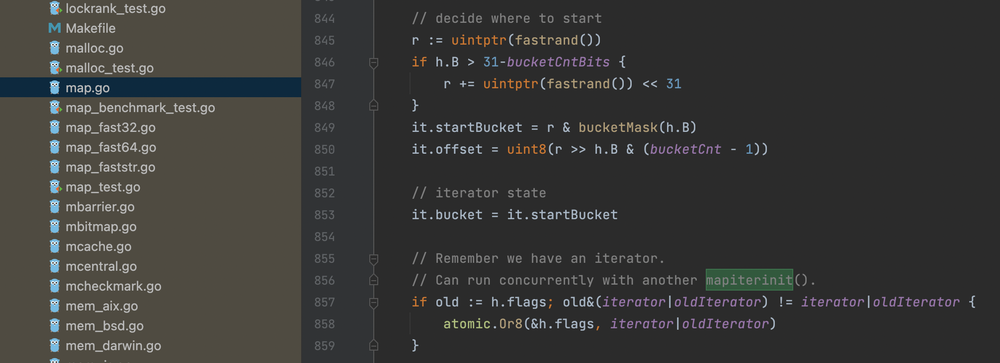

# Map常见引发的问题

## Map的无序的问题

### 背景

主播每日插入一条当天的报价数据，列表展示需要将报价相同的日期聚合，通过日期倒排序，最终产出报表数据。

最开始的实现逻辑：查出主播时间区间内所有数据，通过Map（Key为主播Id，Value为对应所展示数据的结构体）将日期等数据聚合，最后将Map拍平展示。

问题：拍平展示后不符合日期倒排序要求。

### 解决方案

* 使用`sort.Sort`方法，数组拍平后进行重排序

    ```go
    func (t PumaChannelTrendArray) Len() int {
       return len(t)
    }
    
    func (t PumaChannelTrendArray) Less(i, j int) bool {
       return t[i].ChildCards[0].Value > t[j].ChildCards[0].Value
    }
    
    func (t PumaChannelTrendArray) Swap(i, j int) {
       t[i], t[j] = t[j], t[i]
    }
    ```

* 在Value的结构体中引入ArrayIndex属性记录数组下标

     ```go
    masterInfoMap := make(map[string]*po.MediaOrderPo)
    for _, order := range orderInfoList {
       anchorIdStr := strconv.FormatInt(order.AnchorId, 10)
       if mediaOrders, ok := masterInfoMap[anchorIdStr]; !ok {
          // 初始化响应列表信息
          masterInfoMap[anchorIdStr] = po.AdsPopularizeOrderToMediaOrderPo(order)
         // 记录数组对应下标，后续修改对应元素
          masterInfoMap[anchorIdStr].ArrayIndex = len(resp) - 1
          resp = append(resp, *masterInfoMap[anchorIdStr])
       } else {
          resp[mediaOrders.ArrayIndex].SetMediaDayData(order)
       }
    }
    ```

    - 上述代码又引申出了一个新的问题`map不可寻址`

      ```go
      masterInfoMap := make(map[string]po.MediaOrderPo)
      masterInfoMap[anchorIdStr] = po.MediaOrderPo{}
      masterInfoMap[anchorIdStr].Name = "111" // Cannot assign to masterInfoMap[anchorIdStr].ArrayIndex
      ```

* 实现一个有序Map

    - 第三方库：https://github.com/iancoleman/orderedmap

### 无序原因

* Map的底层逻辑是通过哈希表实现的，而哈希表的特点就是无序。每次新插入一个值，会将值进行hash到某一个bucket上，而不是按buckets顺序写入。其他语言例如Java的LinkedHashMap也是在本质无序的基础上增加一个双向链表使无序的Map变为有序。

* 遍历中引入了随机数，避免主要是为了降低开发者对`map`遍历顺序的依赖性

    - map的遍历也分两步：`mapiterinit` 生成map迭代器，`mapiternext`进行map迭代
    - `fastrand`方法会生成一个随机数，根据随机数，选择一个桶位置作为起始点进行遍历迭代

    - 

## Map元素不可寻址

### 什么叫可寻址

可直接使用 `&` 操作符取地址的对象，就是可寻址的

可以寻址：

* 变量：&x
* 指针：&*x
* 数组元素索引: &a[0]
* 切片元素索引：&s[0]

不可寻址：

* 常量

* 函数和方法

* map中的元素

* 基本类型字面量以及数组字面量

    ```go
    fmt.Println([3]string{"a", "b", "c"}[1:]) // Cannot slice '[3]string{"a", "b", "c"}' (type '[3]string')
    
    a := [3]string{"a", "b", "c"}
    fmt.Println(a[1:])
    ```

### 解决方案

* 使用临时变量

    ```go
    masterInfoMap := make(map[string]po.MediaOrderPo)
    var order po.MediaOrderPo{Name: "1111"}
    masterInfoMap[anchorIdStr] = order
    ```

* 使用指针

    ```go
    masterInfoMap := make(map[string]*po.MediaOrderPo)
    masterInfoMap[anchorIdStr] = &po.MediaOrderPo{}
    masterInfoMap[anchorIdStr].Name = "111"
    ```

### 不可寻址原因

map 是一种引用类型，它的值存储了一个指向底层数据结构的指针。当 map 扩容时，会重新分配底层 hash 表的存储空间，并将原有的键值对复制到新的存储空间中。由于值类型的数据是被复制到新的存储空间中的，因此它们的地址发生了变化，即原有的值和新的值在内存中是不同的对象，地址不同，所以无法对这个value进行寻址因此 Go 语言规范中规定了 map 类型的值不可寻址。

指针类型的数据，它们的值在 map 扩容时也会被复制到新的存储空间中，但是这些值指向的数据并没有被复制，它们仍然指向原来的数据对象，指针类型的值在新旧存储空间中的地址是相同的。因此，在对指针类型的值进行取地址操作时，并不会受到 map 扩容的影响，不会导致程序出现不可预期的行为。

## Map并发修改问题

### 背景

### 解决方案

- `sync.Mutex` 是 Go 中标准库提供的一种互斥锁，它通过 mutex 的加锁和解锁机制，保证同一时间只能有一个 goroutine 访问被保护的资源。在使用 `sync.Mutex` 时，我们需要手动加锁和解锁，因此需要特别注意加锁和解锁的粒度，避免死锁等问题。、
- `sync.RWMutex` 是 Go 中标准库提供的一种读写锁，它通过读锁和写锁的机制，保证同一时间可以有多个 goroutine 同时读取被保护的资源，但只能有一个 goroutine 写入被保护的资源。相比于 `sync.Mutex`，`sync.RWMutex` 更适用于读多写少的场景，因为读锁不会阻塞其他读锁，从而提高并发性能。
- `sync.Map` 是 Go 中标准库提供的一种并发安全的 map，将整个 Map 分为若干个段(segment)，每个段内部包含了多个键值对，同时每个段都维护着一个读写锁。当对某个键值对进行读写时，首先需要通过哈希函数找到相应的段，然后再在该段内部进行读写操作，这时候需要获取该段的读写锁。与 `sync.Mutex` 不同，`sync.Map` 不需要手动加锁和解锁，因为它已经内部实现了并发安全的机制。
- `concurrent-map` 是第三方库提供的一种并发安全的 map，其底层实现是基于分片的思想。在 `concurrent-map` 中，将整个 map 分成若干个小的 map，每个小的 map 由一个 goroutine 独占，当有其他 goroutine 访问时，会根据 key 的哈希值来确定它属于哪个小的 map，然后在这个小的 map 中进行读写操作。

### 原因

```go
// 1，读取数据的时候会检查是否正在写入
if h.flags&hashWriting != 0 {
    throw("concurrent map read and map write")
}
// 2，赋值的时候也会检查是否在写入
if h.flags&hashWriting != 0 {
    throw("concurrent map writes")
}
```


## Range遍历问题

当使用 `range` 遍历一个切片或者数组时，Go 编译器会将切片或者数组的元素复制到一个新的数组中，然后依次遍历这个新数组的元素。因此，即使在遍历过程中向原始的切片或者数组中新增元素，也不会对遍历过程产生影响。

当使用 `range` 遍历一个 map 时，Go 编译器会先获取 map 中所有的键，然后依次遍历这些键对应的值。因此，如果在遍历过程中向 map 中新增键值对，这些新增的键值对也不会被遍历到。如果在遍历过程中修改了 map 中已有的键值对，可能会影响到后续的遍历过程。在遍历一个 map 时应该避免修改已有的键值对。

