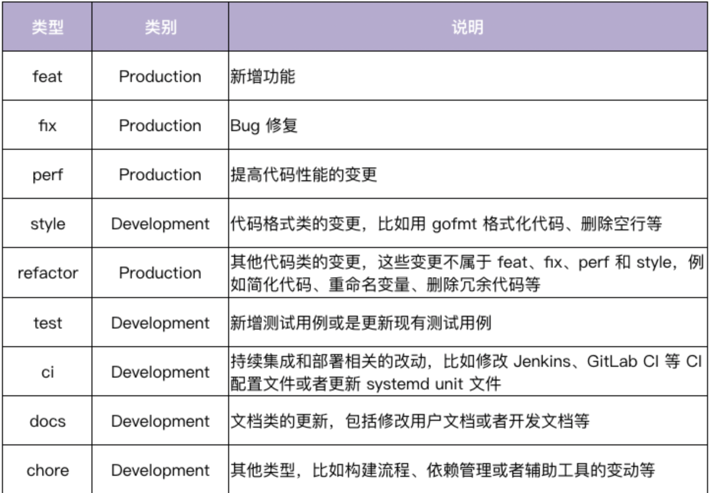

# Commit Message规范
Commit Message 中 Angular 规范在功能上能够满足开发者 commit 需求，在格式上清晰易读，目前也是用得最多的。

在 Angular 规范中，Commit Message 包含三个部分，分别是 Header、Body 和 Footer。
## Header
对 commit 做了高度概括。
Header 部分只有一行，包括三个字段：type（必选）、scope（可选）和 subject（必选）。
### type
用来说明 commit 的类型。

### scope
用来说明 commit 的影响范围的，它必须是名词。

### subject
是 commit 的简短描述，必须以动词开头、使用现在时。

## Body
对本次 commit 的更详细描述，是可选的。

## Footer
主要用来说明本次 commit 导致的后果，是可选的。