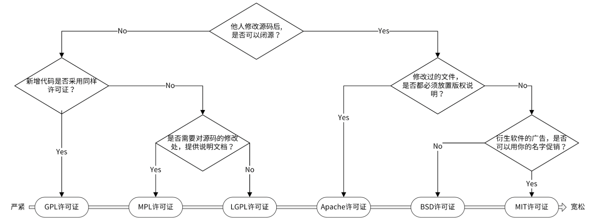
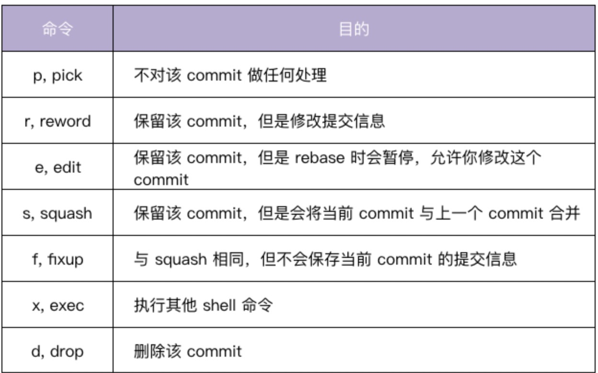
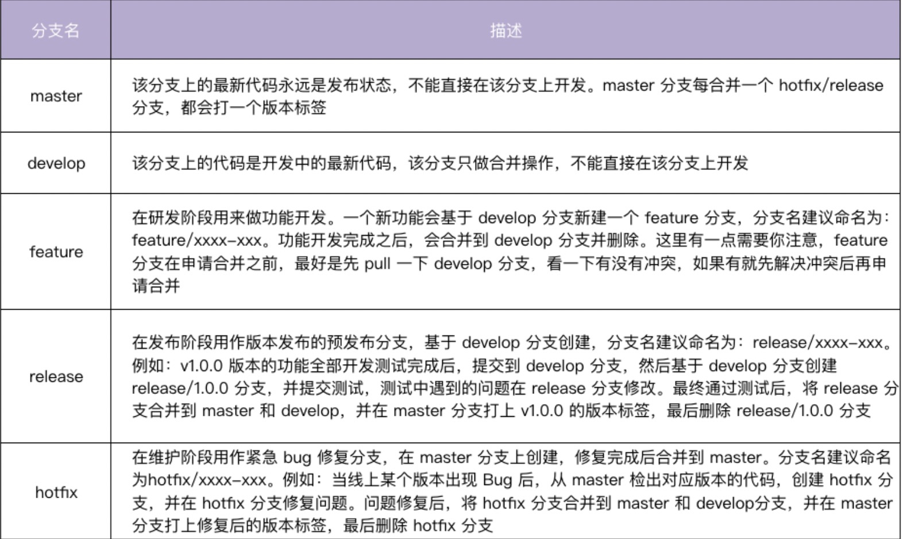
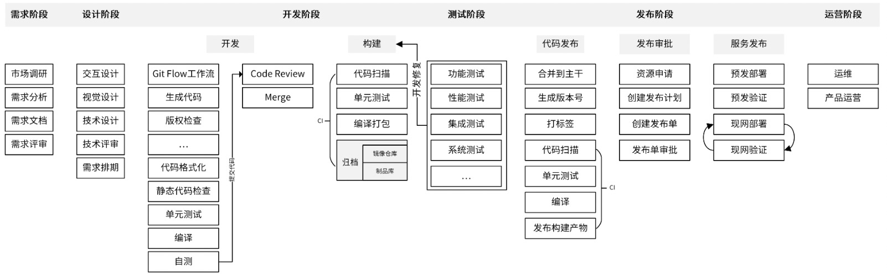

# 项目规范
* 非编码类规范，主要包括开源规范、文档规范、版本规范、Commit 规范和发布规范。
* 编码类规范，则主要包括目录规范、代码规范、接口规范、日志规范和错误码规范。

## 开源规范
### 开源协议

### 规范特点
* 高的单元测试覆盖率
* 专业的项目结构
* 严格遵循代码规范：[Uber Go 语言编码规范](https://github.com/xxjwxc/uber_go_guide_cn)、[Effective Go](https://go.dev/doc/effective_go)
* 版本发布规范
* 向下兼容
* 详细的文档说明
* 好的 Commit Message 记录
* 完善的 examples
* 确保整个代码库和提交记录中，不能出现内部 IP、内部域名、密码、密钥这类信息。
* 开源项目被别的开发者提交 pull request、issue、评论时，要及时处理
## 文档规范
### README 规范
```markdown
# 项目名称

<!-- 写一段简短的话描述项目 -->

## 功能特性

<!-- 描述该项目的核心功能点 -->

## 软件架构(可选)

<!-- 可以描述下项目的架构 -->

## 快速开始

### 依赖检查

<!-- 描述该项目的依赖，比如依赖的包、工具或者其他任何依赖项 -->

### 构建

<!-- 描述如何构建该项目 -->

### 运行

<!-- 描述如何运行该项目 -->

## 使用指南

<!-- 描述如何使用该项目 -->

## 如何贡献

<!-- 告诉其他开发者如果给该项目贡献源码 -->

## 社区(可选)

<!-- 如果有需要可以介绍一些社区相关的内容 -->

## 关于作者

<!-- 这里写上项目作者 -->

## 谁在用(可选)

<!-- 可以列出使用本项目的其他有影响力的项目，算是给项目打个广告吧 -->

## 许可证

<!-- 这里链接上该项目的开源许可证 -->
```
在线生成工具：[readme.so](https://readme.so/)

## 项目文档规范
* 开发文档：用来说明项目的开发流程，比如如何搭建开发环境、构建二进制文件、测试、部署等。
* 用户文档：软件的使用文档，对象一般是软件的使用者，内容可根据需要添加。比如，可以包括 API 文档、SDK 文档、安装文档、功能介绍文档、最佳实践、操作指南、常见问题等。

```path
docs
├── devel                            # 开发文档，可以提前规划好，英文版文档和中文版文档
│   ├── en-US/                       # 英文版文档，可以根据需要组织文件结构
│   └── zh-CN                        # 中文版文档，可以根据需要组织文件结构
│       └── development.md           # 开发手册，可以说明如何编译、构建、运行项目
├── guide                            # 用户文档
│   ├── en-US/                       # 英文版文档，可以根据需要组织文件结构
│   └── zh-CN                        # 中文版文档，可以根据需要组织文件结构
│       ├── api/                     # API文档
│       ├── best-practice            # 最佳实践，存放一些比较重要的实践文章
│       ├── faq                      # 常见问题
│       ├── installation             # 安装文档
│       ├── introduction             # 产品介绍文档
│       ├── operation-guide          # 操作指南，里面可以根据RESTful资源再划分为更细的子目录，用来存放系统核心/全部功能的操作手册
│       ├── quickstart               # 快速入门
│       ├── README.md                # 用户文档入口文件
│       └── sdk                      # SDK文档
└── images                           # 图片存放目录
    └── 部署架构v1.png
```
## API 接口文档规范
规范的 API 接口文档，通常需要包含一个完整的 API 接口介绍文档、API 接口变更历史文档、通用说明、数据结构说明、错误码描述和 API 接口使用文档。API 接口使用文档中需要包含接口描述、请求方法、请求参数、输出参数和请求示例。

通常包含如下 5 部分。
* 接口描述：描述接口实现了什么功能。
* 请求方法：接口的请求方法，格式为 HTTP 方法 请求路径，例如 POST /v1/users。在 通用说明中的请求方法部分，会说明接口的请求协议和请求地址。
* 输入参数：接口的输入字段，它又分为 Header 参数、Query 参数、Body 参数、Path 参数。每个字段通过：参数名称、必选、类型 和 描述 4 个属性来描述。如果参数有限制或者默认值，可以在描述部分注明。
* 输出参数：接口的返回字段，每个字段通过 参数名称、类型 和 描述 3 个属性来描述。
* 请求示例：一个真实的 API 接口请求和返回示例。

## 版本规范
* 通过版本号，可以很明确地知道组件是哪个版本，从而定位到该组件的功能和代码，方便我们定位问题。
* 发布组件时携带版本号，可以让使用者知道目前的项目进度，以及使用版本和上一个版本的功能差别等。

### 语义化版本规范
版本号可按以下规则递增：
* 主版本号（MAJOR）：当做了不兼容的 API 修改。
* 次版本号（MINOR）：当做了向下兼容的功能性新增及修改。这里有个不成文的约定需要你注意，偶数为稳定版本，奇数为开发版本。
* 修订号（PATCH）：当做了向下兼容的问题修正。

详细介绍：[语义化版本](https://semver.org/lang/zh-CN/)

# Commit Message规范
Commit Message 中 Angular 规范在功能上能够满足开发者 commit 需求，在格式上清晰易读，目前也是用得最多的。

在 Angular 规范中，Commit Message 包含三个部分，分别是 Header、Body 和 Footer。
## Header
对 commit 做了高度概括。
Header 部分只有一行，包括三个字段：type（必选）、scope（可选）和 subject（必选）。
### type
用来说明 commit 的类型。


### scope
用来说明 commit 的影响范围的，它必须是名词。

### subject
是 commit 的简短描述，必须以动词开头、使用现在时。

## Body
对本次 commit 的更详细描述，是可选的。

## Footer
主要用来说明本次 commit 导致的后果，是可选的。

## Revert Commit
如果当前 commit 还原了先前的 commit，则应以 `revert:` 开头，后跟还原的 commit 的 Header。而且，在 Body 中必须写成 This reverts commit <hash> ，其中 hash 是要还原的 commit 的 SHA 标识

## commit合并提交
将多个 commit 合并为一个 commit 提交，使commit更清晰。
### git rebase 命令
通过 `git rebase -i <commit ID>`使用 git rebase 命令，`-i` 参数表示交互（interactive）。

交互界面会首先列出给定`<commit ID>`之前的所有 commit，每个 commit 前面有一个操作命令，默认是 pick。我们可以选择不同的 commit，并修改 commit 前面的命令，来对该 commit 执行不同的变更操作。


## Commit Message 规范自动化
[commitizen-go](https://github.com/lintingzhen/commitizen-go)：使你进入交互模式，并根据提示生成 Commit Message，然后提交。
[go-gitlint](https://github.com/llorllale/go-gitlint)：检查历史提交的 Commit Message 是否符合 Angular 规范，可以将该工具添加在 CI 流程中，确保 Commit Message 都是符合规范的。
[git-chglog](https://github.com/git-chglog/git-chglog)：根据 Commit Message 生成 CHANGELOG。

# 目录结构
推荐：[结构化目录结构](https://github.com/golang-standards/project-layout)

```path
├── api
│   ├── openapi
│   └── swagger
├── build               # 存放安装包和持续集成相关的文件
│   ├── ci              # 存放 CI 的配置文件和脚本。
│   ├── docker          # 存放子项目各个组件的 Dockerfile 文件
│   ├── package         # 存放容器、系统的包配置和脚本。
├── CHANGELOG           # 版本的更新内容或者历史更新内容
├── cmd                 # main 函数
├── configs             # 配置文件模板或默认配置
├── CONTRIBUTING.md     # 说明如何贡献代码，如何开源协同等等
├── deployments         # 用来存放 Iaas、PaaS 系统和容器编排部署配置和模板
├── docs                # 存放设计文档、开发文档和用户文档等
├── examples            # 应用程序或者公共包的示例代码
├── init                # 存放初始化系统和进程管理配置文件
├── internal            # 私有应用和库代码
│   ├── server          # 应用目录，包含应用程序的实现代码
│   │   ├── api         # HTTP API 接口的具体实现
│   │   │   └── v1
│   │   ├── options     # 应用的 command flag
│   │   ├── service     # 复杂业务处理代码
│   │   ├── store       # 持久化的存储
│   │   │   ├── mysql
│   │   └── testing
│   ├── pkg             # 内部共享包存放的目录
│   │   ├── code        # 项目业务 Code 码
│   │   ├── middleware  # 中间件
├── LICENSE             # 版权文件，推荐工具： addlicense 
├── Makefile
├── _output
│   ├── platforms
│   │   └── linux
│   │       └── amd64
├── pkg                 # 存放可以被外部应用使用的代码库
├── README.md
├── scripts             # 存放脚本文件
│   ├── lib             # 用来存放 shell 脚本
│   ├── make-rules      # 用来存放 makefile 文件
│   ├── install         # 自动化部署脚本
├── test                # 其他外部测试应用和测试数据
├── third_party         # 外部帮助工具
└── tools               # 项目的支持工具
├── go.mod
├── go.sum
└── web                 # 前端代码
```

# Git Flow 工作流


# 开发流程

