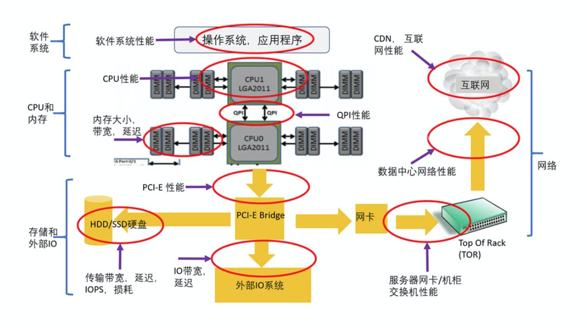

# 性能分析与优化

系统性能是互联网应用最核心的非功能性架构目标，系统因为高并发访问引起的首要问题就是性能问题：高并发访问的情况下，系统因为资源不足，处理每个请求的时间都会变慢，看起来就是性能变差。

## 性能分析

### 性能的外部指标

* 服务延迟/响应时间: 指请求花费在处理上的时间/处理请求的时间以及来回的网络延迟和各种排队的延迟

  > 我们在考察服务延迟或响应时间的时候，不能把均值作为依据，它并不是一个合适的指标，因为它掩盖了一些信息，无法告诉用户实际经历了多少延迟。最好使用百分位数，可以用搜集到的时间信息将其从最快到最慢排序，中位数就是列表中间的响应时间。如果中位数为200ms，则业务有一半请求不到200ms，另一半则需更长的时间。如果为了弄清异常值有多糟糕，需要关注更大的百分位数如常见的95、99和99.9（缩写p95、p99、p999）值。作为典型的响应时间阈值，他们分别表示有95%、99%或99.9%的请求响应时间快于阈值。

* 吞吐率: 指的是单位时间（比如每秒钟）可以成功处理的请求数或任务数。

  > 吞吐率，现实中的系统往往有一个峰值极限。超过这个峰值极限，系统就会超载，除了服务延迟超标，还会造成一系列的性能问题（比如系统挂掉）。这个峰值极限往往需要经过仔细的性能测试，并且结合访问延迟标准来确定。有了这个峰值极限值后，系统的设计和运维就需要确保系统的负载不要超过这个值。

* 资源使用率: CPU、内存、磁盘、网络等

  > 资源使用率：随时都会有意外事件（比如流量波动）或者部分网络故障，这就需要整个系统资源保留一定的缓冲，来应付这些意外和从发生的灾难中恢复

这三个性能指标的变化有它们自己的特点，而且经常会互相影响。对一个系统而言，如果吞吐率很低，服务延迟往往会非常稳定。当吞吐率增高时，访问延迟一般会快速增加。

### 性能问题原因

所有的性能问题，虽然表现方式各异，归根结底都是某种资源受到制约，不够用了。这里的资源指的是一个计算机系统，程序和互联网服务会用到的每一种资源。换句话说，客户的请求在处理时在某个地方“卡住了”。这个卡住的地方就叫“瓶颈”。

上图的十大瓶颈也可以大致分为四类：

* 软件系统：包括操作系统、应用程序、各种类库以及文件系统。
* CPU 和内存：包括 CPU 性能、QPI（QuickPath Interconnect，处理器之间的快速通道互联）和缓存内存。
* 存储和外部 IO：包括处理器的 IO 的接口性能、各种存储系统（尤其是 HDD 和 SSD 性能）。
* 网络：包括服务器到机柜交换机的网络、数据中心的网络、CDN 和互联网。

性能分析的目的，是提供高性能、低延迟、高效率的服务。要实现这一目的，就需要找到系统和服务的性能瓶颈，然后尽可能的消除瓶颈，或者降低瓶颈带来的影响。系统和服务有性能瓶颈就说明这个地方的资源不够用了。所谓最大的性能瓶颈，就是说这个地方的资源短缺程度最大，相对而言，其他地方的资源有富余。

### 性能分析的三个层次

第一个层次是可能的性能瓶颈，比如上述的十大瓶颈。知道了瓶颈才能有目标的去分析。

第二个层次是每个瓶颈有哪些资源有可能短缺。比如内存就有很多种不同的资源，不仅仅是简单的内存大小。除了内存使用量，还有内存带宽和内存访问延迟。

第三个层次是对每个瓶颈的每种资源要了解它和其他模块是如何交互的，对整个系统性能是如何影响的，它的正常值和极限值是多少，如何分析测量等等。

找到性能最大瓶颈后，具体的优化方式就是什么资源不够就加什么资源，同时尽量降低资源消耗，这样就可以做到在资源总量一定的情况下，有能力支撑更高的吞吐率和实现更低的延迟。

### 依据数据和剖析来分析

当我们怀疑性能有问题的时候，应该通过合理的测试、日志分析，并作合适的剖析，来分析出哪里有问题，而不是凭感觉、撞运气。比如，如果是 CPU 相关的性能问题，系统绝大多数的时间应该都耗费在少量的代码片段里面。如何找出这些需要优化的代码，我们可以利用语言提供的分析工具来作为依据。例如GO语言的`pprof`。

### 检测工具

* CPU：top(实时显示系统中各个进程的资源占用状况)、perf(进行函数级与指令级的热点查找)
* 内存：free(当前系统内存的使用情况)、vmstat(用来获得有关进程、虚存、页面交换空间及CPU活动的信息)
* 存储：iostat(磁盘活动统计情况)
* 网路：netstat(打印 Linux 系统的网络状态信息)、traceroute(数据包从我们的计算机到互联网远端的主机，走的什么网络路径)

## 性能优化

### 三个要原则

* 要优先查最大的性能瓶颈

  > 一般来讲，如果找到最大的性能瓶颈，并且解决了它，那这个系统的性能会得到最大的提升。反之，如果不解决最大的性能瓶颈，反而退而求其次，去解决了其他的性能问题，整个系统的性能或许会更高一些，但是提升的程度往往是非常有限的。如果一个应用程序的最大性能瓶颈是 CPU 的使用率太高，最有效的方法是做性能分析和剖析，找出程序中使用CPU 最多的地方，然后对症下药地做优化。

* 性能分析要确诊性能问题的根因

  > 当确定了最大的性能瓶颈后，就需要对这一性能瓶颈做彻底的性能分析，找出资源不够使用的原因, 也就是考察使用资源的地方。一种资源被使用的地方往往有好几个，我们需要一个一个地去分析考虑。只有彻底分析了各种使用的情况，才能进一步找出最主要的，也是最可能优化的原因，对症下药。有些资源使用的原因也许是完全合理的。对这些合理的使用，有些或许已经仔细优化过了，很难再做优化。而另外一些则有可能继续优化。对资源的不合理使用，我们就要尽量想办法去掉。对于需要优化的地方，我们需要进一步考虑优化工作的投入产出比例，既要考虑成本，也考虑带来的好处。因为有些情况下，虽然你可以去优化，但获得的收益并不大，所以不值得去做。

* 性能优化要考虑各种的情况

  > 针对某个具体场景提出的一个解决方案，多半并不能适应所有的场景。所以，对提出的各种方案进行评估时，我们必须考虑各种情况下这个方案可能的表现。如果一个方案在某些情况下会导致其他严重的问题，这个方案或许就不是一个好的方案。需要在不同性能指标间权衡，以找到一个最优解能达到总体和整体最优。

### 三个不要原则

* 不要过度地反常态优化

  > 性能优化的目标，是追求最合适的性价比或最高的投入产出比，在满足要求的情况下，尽量不要做过度的优化。过度的优化会增加系统复杂度和维护成本，使得开发和测试周期变长。可以根据产品的性能要求来决策。

* 不要过早的不成熟优化

  > 过早的优化很可能优化错地方，也就是优化的地方并非真正的性能瓶颈，因此让“优化工作”成为了无用功。而且，越早的优化就越容易造成负面影响，比如影响代码的可读性和维护性。当一个产品已经在业界很成熟，大家非常清楚它的生产环境特点和性能瓶颈，那么优化的重要性可以适当提高。否则的话，在没有实际数据指标的基础上，为了一点点的性能提升而进行盲目优化，是得不偿失的。

* 不要表面的肤浅优化

  > 如果对一个程序和服务没有全局的把握，没有理解底层运行机制，任何优化方案都很难达到最好的优化效果。
  >
  > 比如，如果你发现一个应用程序的 CPU 使用率并不高，但是吞吐率上不去，表面的优化方式可能是增大线程池来提升 CPU 使用率。这样的情况下，线程池开多大最合适？需不需要根据底层硬件和上层请求的变化而对线程池的大小调优呢？如果需要，那么手工调整线程池大小就是一个典型的表面优化。因为部署环境不会一成不变，比如以后 CPU 升级了，核数变多了，需要再次手工去调整并且很容易出错。正确的优化方式，是彻底了解线程的特性，以优化线程为主。至于线程池的大小，最好能够自动调整。千万别动不动就手工调优。如果这样手工调整的参数多了，就会做出一个有很多可调参数的复杂系统，很难用，也很难调优。

### 优化策略

#### 用时间换空间

改变应用程序本身的数据结构或者数据格式，减少需要存储的数据的大小；想方设法压缩存在内存中的数据，比如采用某种压缩算法，真正使用时再解压缩；把一些内存数据，存放到外部的、更加便宜的存储系统里面，到需要时再取回来。

#### 用空间换时间

 将用户要访问的数据和服务，尽量放在离他们很近的地方（CDN 内容分发）；程序部署在多个服务器来换取延迟的减少。

#### 预先/提前处理

硬件预取是通过处理器中的硬件来实现的。该硬件会一直监控正在执行程序中请求的指令或数据，并且根据既定规则，识别下一个程序需要的数据或指令并预取。

软件预取是在程序编译的过程中，主动插入预取指令（prefetech），这个预取指令可以是编译器自己加的，也可以是我们加的代码。这样在执行过程中，在指定位置就会进行预取的操作。

#### 延后/惰性处理

`写时复制`就是利用这一策略。 Unix 系统 fork 调用产生的子进程共享父进程的地址空间，只有到某个子进程需要进行写操作才会拷贝一份。

#### 并行操作

绝大多数互联网服务器，要么使用多进程，要么使用多线程来处理用户的请求，以充分利用多核 CPU。另外一种情况就是在有 IO 阻塞的地方，也是非常适合使用多线程并行操作的，因为这种情况 CPU 基本上是空闲状态，多线程可以让 CPU 多干点活。

#### 异步操作

采用异步操作的话，会让性能的吞吐率有很大提升。

#### 缓存数据

在文件系统、存储系统和数据库系统里面，也有快速缓存来存储经常访问的数据，目的是尽量提高缓存命中率，从而避免访问比较慢的存储介质。程序设计中，对于可能重复创建和销毁，且创建销毁代价很大的对象，也可以缓存，对应的缓存形式，就是连接池和线程池等。对于消耗较大的计算，也可以将计算结果缓存起来，下次可以直接读取结果。

#### 批量合并处理

在有多次 IO 的时候，可以把它们合并成一次读写数据。这样可以减少读写时间和协议负担。涉及到网络请求的时候，网络传输的时间可能远大于请求的处理时间，因此合并网络请求也很有必要。

#### 先进的算法

同一个问题，肯定会有不同的算法实现，进而就会有不同的性能。对每一种具体的场景，总会有一种算法是最适合的。我们需要考虑实际情况，来选择这一最优的算法。

#### 高效的数据结构

通过添加元素、删除元素、查询元素、遍历耗时等等指标权衡取舍，找出实际场合下最适合的高效的数据结构。
